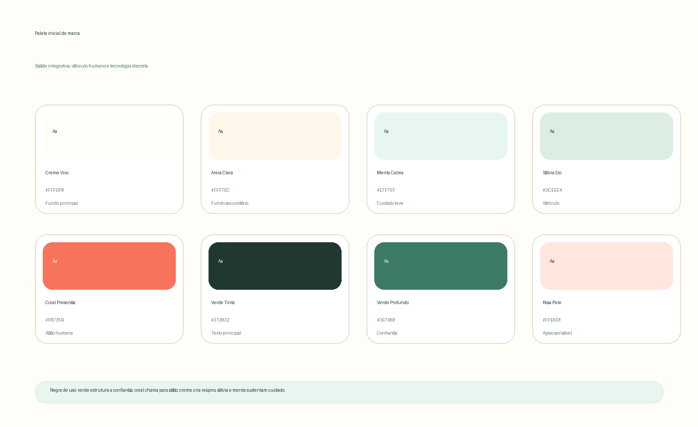

# Naming e branding — leitura estratégica para discussão

**Autor:** SIDNEY (PMO SENIUM)  
**Projeto:** Saúde Integrativa IA DEV  
**Data:** 01 de maio de 2026  
**Status:** documento de discussão, não decisão final de marca

## 1. Minha leitura do documento enviado

O documento é útil porque tira a discussão do gosto pessoal e coloca a palavra **Elo** no centro da estratégia. A tese mais importante é que **DOUTORELO** funciona melhor no Brasil do que **DOCTORELO** no exterior, não porque a versão inglesa seja ruim, mas porque, em português, “elo” já nasce carregado de vínculo, conexão, continuidade, travessia e confiança. Para um projeto que une pessoa, IA, médicos, conteúdo, acompanhamento e eventualmente marketplace, esse campo semântico tem valor real.

A leitura, porém, não pode parar na semântica. Em saúde, nome é também promessa clínica, risco regulatório, superfície jurídica, memória comercial e contrato emocional. O documento acerta ao dizer que nomes como **DoctorFlow** e **DoctorLink** são mais claros em inglês, mas a clareza não resolve tudo. **DoctorFlow** já aparece como sistema de fluxo de clínicas, com promessa operacional explícita de status de sala, handoffs, filas e métricas; portanto, carrega um território competitivo muito diferente do nosso e não deve ser adotado como alternativa.[1] **DoctorLink** já foi usado em saúde digital dentro do ecossistema HealthHero, mesmo que hoje a própria página informe que o produto e a marca não estão mais em uso.[2]

A tensão principal está no Brasil: **DOUTORELO** é emocionalmente forte, mas precisa ser validado com cuidado por causa da proximidade perceptiva com **Doutore**, que se apresenta como sistema médico para clínicas e consultórios, com prontuário eletrônico, agenda médica e financeiro.[3] A página oficial do INPI reforça que a decisão deve passar por busca de processos/base de dados, classes, peticionamento e, se houver ambição internacional, Sistema de Madri.[4]

> Minha leitura objetiva: **DOUTORELO não deve ser abandonado agora. Ele deve entrar como hipótese principal Brazil-first, mas não como verdade final. O erro seria trocar para um nome genérico apenas para parecer mais internacional. O outro erro seria escolher DOUTORELO sem resolver arquitetura, grafia, proteção jurídica e significado de marca.**

## 2. O problema estratégico que o nome precisa resolver

Este projeto não é apenas uma agenda médica, um chatbot de triagem, um marketplace de saúde ou um blog de conteúdo. Ele quer ser uma **orquestração de cuidado**: uma experiência onde a pessoa chega com uma dúvida, um sintoma, um incômodo ou uma intenção de saúde e encontra um próximo passo mais claro, mais humano e mais confiável.

Por isso, o nome precisa equilibrar quatro forças que frequentemente entram em conflito. Ele precisa gerar **confiança clínica** sem prometer medicina automatizada; precisa gerar **calor humano** sem parecer spa genérico; precisa permitir **receita e expansão** sem virar e-commerce oportunista; e precisa aceitar **IA** sem parecer produto frio, técnico ou experimental.

| Força exigida da marca | O que ela precisa comunicar | Risco se for mal resolvida |
|---|---|---|
| Confiança clínica | Há médicos, critérios, consentimento e responsabilidade. | Parecer promessa médica sem sustentação. |
| Cuidado humano | A pessoa é acolhida, não processada. | Parecer app técnico ou robótico. |
| Continuidade | A jornada não acaba na primeira conversa. | Parecer ferramenta pontual de sintomas. |
| Elasticidade comercial | Consultas, conteúdo e produtos cabem no ecossistema. | Parecer marketplace disfarçado de saúde. |

## 3. Naming: hipóteses reais para a próxima rodada

Eu trabalharia com **cinco famílias de naming**, não com cinquenta nomes soltos. A discussão precisa escolher território antes de escolher palavra. Quando se começa por listas enormes, a decisão vira estética. Quando se começa por arquitetura, a decisão vira estratégia.

| Família | Exemplo de nome | Força | Fragilidade | Minha leitura |
|---|---|---|---|---|
| Brazil-first com Elo | **Doutor Elo** ou **Doutor·Elo** | Forte em vínculo, claro em saúde, brasileiro. | Proximidade com Doutore; pode estreitar demais em “médico”. | Melhor hipótese inicial se a ambição prioritária é Brasil. |
| Marca proprietária sem “Doutor” | **EloVita**, **EloCare**, **VivaElo** | Mais elástica para IA, conteúdo, marketplace e bem-estar. | Pode perder autoridade clínica imediata. | Boa família para testar se quisermos uma marca-mãe mais ampla. |
| Plataforma de cuidado | **Nexo Saúde**, **Nexo Vital**, **CuraNexo** | Comunica conexão e sistema. | Alguns nomes podem soar frios ou corporativos. | Forte se o projeto quiser parecer infraestrutura confiável. |
| Healthtech internacional | **EloHealth**, **CareElo**, **EloCare** | Mais exportável, fácil de explicar. | Pode ficar genérico em inglês. | Útil como camada internacional, não necessariamente como marca Brasil. |
| Nome descritivo atual | **Saúde Integrativa IA** | Claro e funcional. | Fraco como marca memorável; parece categoria, não ativo. | Bom como descritor ou subtítulo, não como marca principal definitiva. |

Minha recomendação inicial é separar **marca de produto** e **descritor de categoria**. O caminho mais forte hoje parece ser usar um nome proprietário como marca e manter “saúde integrativa com IA” como explicação, não como marca. Por exemplo: **Doutor·Elo — saúde integrativa com inteligência e médicos reais**. Essa formulação ainda não é slogan final, mas mostra a arquitetura correta: primeiro vem a marca memorável; depois vem o que ela faz.

## 4. Arquitetura de marca recomendada

A arquitetura que mais protege o projeto é uma **marca-mãe emocional e proprietária**, com módulos funcionais nomeados de forma simples. Isso evita que cada área pareça um produto separado e ajuda o usuário a sentir continuidade.

| Camada | Possível escolha | Função |
|---|---|---|
| Marca-mãe | **Doutor·Elo** ou alternativa proprietária com Elo | Carregar memória, confiança e vínculo. |
| Descritor | Saúde integrativa com IA e médicos reais | Explicar o que a plataforma faz sem virar nome principal. |
| Módulo de conversa | Conversa de cuidado | Evitar “chatbot” e reduzir frieza técnica. |
| Módulo médico | Rede médica | Mostrar presença humana sem transformar tudo em diretório. |
| Conteúdo | Saber guiado | Conteúdo curado, não blog solto. |
| Marketplace | Seleção de cuidado | Comércio separado de prescrição clínica. |
| Plano contínuo | Jornada ou Plano de cuidado | Materializar continuidade e recorrência. |

A grafia merece atenção. Eu evitaria **DOUTORELO** como bloco único na comunicação principal, porque ele pode ser lido como “Doutorelo” e se aproximar de “Doutore”. Eu testaria **Doutor Elo**, **Doutor·Elo** e, em alguns contextos premium, **DOUTOR ELO** com separação gráfica clara. A separação visual não é detalhe; é parte da estratégia jurídica, fonética e perceptiva.

## 5. Recomendação provisória de naming

Minha recomendação provisória é: **manter Doutor·Elo como hipótese principal de discussão**, mas abrir uma rodada curta com duas alternativas sem “Doutor” para verificar se a marca precisa ser mais ampla que a figura médica. Eu não escolheria ainda. Eu testaria.

| Critério | Doutor·Elo | Marca sem “Doutor” | Saúde Integrativa IA |
|---|---:|---:|---:|
| Confiança imediata | Alta | Média | Média |
| Calor humano | Alta | Alta | Média |
| Memorabilidade | Alta | Média/alta | Baixa |
| Elasticidade para IA e marketplace | Média | Alta | Média |
| Risco de parecer genérico | Médio | Médio | Alto |
| Risco perceptivo/jurídico inicial | Médio | Indeterminado | Baixo/médio |
| Potencial de marca premium | Alto | Alto | Médio |

A decisão não deve ser tomada por preferência interna. O próximo passo correto é comparar **Doutor·Elo**, uma alternativa com **Elo sem Doutor**, uma alternativa com **Nexo**, uma alternativa internacionalizável e o descritor atual. O teste deve medir compreensão, confiança, lembrança, vontade de clicar, percepção de cuidado humano e percepção de seriedade clínica.

## 6. Missão, visão e tese de marca

A missão não deve falar primeiro de IA. A IA é meio, não destino. A promessa principal precisa ser humana: ajudar a pessoa a entender melhor sua saúde, encontrar orientação confiável e seguir uma jornada com mais clareza. Quando a marca começa por “IA”, ela parece laboratório. Quando começa por “cuidado”, a tecnologia entra como inteligência de bastidor.

> **Missão proposta:** aproximar pessoas de um cuidado em saúde mais claro, contínuo e confiável, combinando escuta, inteligência e profissionais qualificados para transformar dúvidas em próximos passos responsáveis.

> **Visão proposta:** tornar-se a plataforma brasileira de referência para jornadas de saúde integrativa guiadas por inteligência, médicos reais e acompanhamento humano, ajudando pessoas a cuidarem melhor de si antes, durante e depois da consulta.

> **Tese de marca:** saúde não começa no diagnóstico; começa quando alguém consegue organizar o que sente, entender o que importa e encontrar o próximo passo certo com confiança.

Essa tese é mais madura do que “app de IA para saúde”. Ela posiciona a plataforma como **infraestrutura de orientação e continuidade**, não como substituto de médico e não como vitrine de produtos. A experiência pode ter IA, marketplace, médicos, conteúdo e comunidade, mas a marca precisa ser percebida como **elo confiável entre intenção, cuidado e ação**.

## 7. Valores editoriais e operacionais

Os valores precisam ser úteis para tomada de decisão, não apenas bonitos em uma página institucional. A marca deve conseguir perguntar: “isso aumenta clareza?”, “isso respeita a pessoa?”, “isso separa cuidado de comércio?”, “isso reduz ruído?”.

| Valor | Definição prática | Como aparece no produto |
|---|---|---|
| Clareza | Traduzir complexidade sem banalizar saúde. | Perguntas simples, respostas organizadas, próximos passos visíveis. |
| Continuidade | Tratar cuidado como jornada, não como evento isolado. | Histórico, plano, lembretes, retorno, acompanhamento. |
| Responsabilidade | Integrar tecnologia sem fingir que ela substitui julgamento clínico. | Médicos identificáveis, consentimento claro e critérios de encaminhamento. |
| Acolhimento | Fazer a pessoa se sentir acompanhada, não julgada. | Tom calmo, brasileiro, sem alarmismo e sem frases artificiais. |
| Integração | Conectar sintomas, hábitos, médicos, conteúdo e recursos. | Jornada única, módulos coerentes e linguagem consistente. |
| Discernimento comercial | Recomendar produtos e serviços com separação ética do cuidado clínico. | Marketplace curado, sem parecer prescrição automática. |

## 8. Personalidade da marca

A personalidade que eu recomendo não é “amigável” no sentido genérico. Ela deve ser **serena, inteligente, próxima e responsável**. Uma boa comparação seria: menos startup animada, menos hospital frio, menos guru de bem-estar; mais consultório contemporâneo, editorial médico cuidadoso e tecnologia discreta.

| A marca deve soar como | A marca não deve soar como |
|---|---|
| Uma conversa calma com alguém preparado. | Um chatbot que tenta parecer humano. |
| Uma clínica moderna que respeita tempo e contexto. | Um SaaS médico operacional. |
| Uma curadoria confiável de próximos passos. | Um marketplace vendendo solução para tudo. |
| Uma inteligência que organiza a jornada. | Uma IA se explicando defensivamente. |
| Uma marca brasileira sofisticada. | Um nome em inglês genérico de healthtech. |

O tom verbal deve ser direto, mas não seco. Deve acolher, mas não infantilizar. Deve orientar, mas não mandar. Deve falar de saúde com seriedade, mas sem carregar a interface de linguagem jurídica. A marca precisa ter coragem de ser simples.

## 9. Território verbal

Eu proponho um território verbal baseado em **clareza, cuidado e continuidade**. As palavras centrais seriam: cuidado, jornada, clareza, escuta, orientação, acompanhamento, vínculo, próximo passo, rede, médico, integrativo, confiança, rotina, sinais e continuidade. As palavras que eu evitaria como eixo principal são: diagnóstico, prescrição, triagem, algoritmo, chatbot, sintoma checker, disrupção, medicina do futuro e inteligência artificial como protagonista.

| Situação | Linguagem recomendada | Linguagem a evitar |
|---|---|---|
| Entrada do usuário | “Conte o que está acontecendo. A gente organiza com você.” | “Descreva seus sintomas para a IA.” |
| Encaminhamento | “Veja caminhos possíveis para seguir com segurança.” | “Receba diagnóstico preliminar.” |
| Consulta | “Encontre profissionais para continuar o cuidado.” | “Escolha um médico parceiro.” |
| Conteúdo | “Leia orientações para entender melhor sua jornada.” | “Conteúdo gerado por IA.” |
| Marketplace | “Itens selecionados para apoiar sua rotina.” | “Produtos recomendados para seu caso.” |

Uma linha verbal possível para a marca seria: **“Cuidado começa quando você entende o próximo passo.”** Ela é simples, não promete cura, não grita tecnologia e conversa com o usuário em um momento real de incerteza. Outra possibilidade mais institucional seria: **“O elo entre sua dúvida e um cuidado mais claro.”** Essa segunda conversa diretamente com o naming, mas pode ficar explicativa demais se usada em excesso.

## 10. Slogans e descritores para testar

Eu não fecharia slogan agora. Eu testaria pequenos descritores em contexto: hero, app, assinatura institucional, apresentação para médicos e apresentação para investidores. Um bom slogan para usuário final nem sempre serve para médico, e um bom descritor para investidor pode soar frio para paciente.

| Opção | Melhor uso | Comentário |
|---|---|---|
| **Cuidado começa pelo próximo passo.** | Hero e campanhas | Forte, humano e memorável. |
| **O elo entre sua dúvida e um cuidado mais claro.** | Institucional | Conecta diretamente com Elo. |
| **Saúde integrativa com inteligência e médicos reais.** | Descritor funcional | Explica sem virar promessa grandiosa. |
| **Organize sua jornada de saúde com mais clareza.** | Produto/app | Direto e operacional. |
| **Escuta, orientação e continuidade para cuidar melhor.** | Manifesto | Mais amplo e emocional. |

Minha preferência inicial é combinar **Doutor·Elo** com o descritor **“saúde integrativa com inteligência e médicos reais”** e, no hero, usar algo mais humano: **“Cuidado começa pelo próximo passo.”** Isso cria três camadas: marca, explicação e emoção.

## 11. Direção visual inicial

A interface atual já aponta para uma direção adequada: fundo quente, verde sálvia, menta, coral suave, cartões translúcidos e tipografia com contraste entre sans moderna e serif editorial. Isso é uma boa base, mas ainda não é um **sistema de marca**. Hoje a paleta funciona como atmosfera de produto; o próximo passo é transformá-la em códigos proprietários: quais cores são institucionais, quais são funcionais, quais indicam cuidado, quais indicam ação e quais devem ser evitadas em contexto clínico.

Eu manteria a direção geral: **clínica contemporânea, editorial premium, tecnologia discreta e cuidado brasileiro**. Não iria para azul hospitalar padrão, nem para verde wellness saturado, nem para roxo de IA. A marca precisa parecer segura sem parecer fria, integrativa sem parecer esotérica e tecnológica sem parecer experimental.

| Elemento | Direção recomendada | Justificativa |
|---|---|---|
| Atmosfera | Warm clinical editorial | Une saúde, acolhimento e sofisticação. |
| Fundo | Creme quente com gradientes suaves | Reduz frieza hospitalar e melhora conforto visual. |
| Cor principal | Verde profundo/sálvia | Comunica saúde, equilíbrio e confiança sem clichê hospitalar. |
| Cor de ação | Coral terroso | Humaniza CTAs e evita azul SaaS genérico. |
| Cor de apoio | Menta clara e areia | Sustenta módulos, cartões e estados leves. |
| Cor de texto | Verde-ink escuro | Mais distintivo que preto puro e menos agressivo visualmente. |
| Forma | Cartões arredondados, camadas translúcidas, sombras macias | Passa continuidade, calma e organização. |
| Imagem | Pessoas reais, detalhes de consulta, gestos de cuidado, natureza discreta | Evitar banco de imagens hospitalar ou wellness superficial. |

## 12. Paleta recomendada

A paleta abaixo parte do que já está implementado e organiza os papéis de marca. Eu não mexeria radicalmente agora; faria refinamento e nomeação. A marca precisa ganhar consistência antes de ganhar complexidade.

| Papel | Nome sugerido | Hex aproximado | Uso recomendado |
|---|---|---:|---|
| Fundo principal | Creme Vivo | `#FFFDF8` | Fundo geral, áreas amplas, sensação de luz. |
| Fundo secundário | Areia Clara | `#FFF7EC` | Seções editoriais, blocos de conteúdo e transições. |
| Cuidado leve | Menta Calma | `#E7F7EF` | Cartões de apoio, estados positivos, superfícies secundárias. |
| Vínculo | Sálvia Elo | `#DCEEE4` | Padrões, badges, divisores e módulos de cuidado. |
| Ação humana | Coral Presença | `#F8735B` | CTA principal, destaques e pontos de energia. |
| Texto principal | Verde Tinta | `#213832` | Títulos, textos longos e navegação. |
| Confiança | Verde Profundo | `#3E7A68` | Marca, botões institucionais e elementos de autoridade. |
| Apoio sensível | Rosa Pele | `#FFE6DF` | Microdetalhes, áreas de acolhimento e estados suaves. |

A regra de uso deve ser simples: **verde para confiança e estrutura, coral para ação humana, creme para espaço, menta/sálvia para cuidado, rosa pele apenas como detalhe sensível**. Se o coral for usado em excesso, a marca vira promocional. Se o verde dominar demais, ela vira clínica tradicional. Se o creme for muito presente sem contraste, a experiência pode parecer fraca. O equilíbrio é parte da identidade.

## 13. Tipografia recomendada

A combinação atual de **Inter** e **Instrument Serif** é coerente com a intenção de marca. A Inter resolve interface, legibilidade e produto. A Instrument Serif traz editorialidade, calor e uma camada humana. Eu manteria essa combinação nesta fase, mas definiria regras mais rígidas.

| Fonte | Papel | Uso recomendado | Cuidado |
|---|---|---|---|
| Inter | Produto, navegação, formulários, corpo de texto | Texto funcional, botões, cards, labels, backoffice. | Evitar pesos muito pesados em excesso para não parecer SaaS agressivo. |
| Instrument Serif | Marca, chamadas, frases editoriais | Hero, manifesto, títulos emocionais e assinatura institucional. | Usar com parcimônia; se tudo vira serif, a interface perde clareza digital. |

Se a marca caminhar para um território mais premium e menos SaaS, poderíamos testar **Söhne/Untitled Sans** como referência paga para sans e **Canela/Reckless/Editorial New** como referência editorial. Mas para uma versão de produto eficiente e web-friendly, Inter + Instrument Serif é suficiente. O ponto não é trocar fonte; é usar melhor.

## 14. Sistema semiótico

O símbolo não deveria ser uma cruz médica, nem um cérebro de IA, nem um coração genérico. O projeto precisa de um símbolo que represente **elo, continuidade, orientação e presença humana**. Eu exploraria uma forma proprietária com dois gestos: um ponto de pessoa e uma linha de continuidade; ou dois arcos que se aproximam sem virar corrente literal.

| Território visual | Possível símbolo | Risco |
|---|---|---|
| Elo | Dois arcos conectados, nó suave, ponte | Ficar literal demais como corrente. |
| Cuidado | Mão abstrata, abraço geométrico, contorno orgânico | Parecer clínica terapêutica genérica. |
| Orientação | Linha de jornada, ponto de partida e próximo passo | Parecer app de produtividade. |
| Saúde | Pulso, folha, cruz reinterpretada | Virar clichê médico/wellness. |
| IA discreta | Malha leve, pontos conectados, gradiente inteligente | Parecer startup de tecnologia e perder calor humano. |

Minha sugestão: criar um símbolo de **elo vivo**, não um ícone médico. Ele deve poder aparecer como favicon, app icon, selo de curadoria, marca d’água em cartões e padrão de fundo. Se o nome escolhido for **Doutor·Elo**, o ponto central entre as palavras pode virar recurso gráfico: um ponto de encontro, não apenas pontuação.

## 15. Missão visual da marca

A missão visual pode ser resumida assim: **fazer saúde digital parecer menos apressada, menos fria e menos fragmentada**. A marca deve transmitir que existe uma inteligência organizando a jornada, mas sem colocar a máquina no centro. O usuário deve sentir: “aqui eu consigo respirar, entender e seguir”.

Isso exige disciplina. A interface não pode ficar cheia de selos, disclaimers, gradientes, ícones médicos, promessas e cartões simultâneos. A sofisticação virá mais da hierarquia, do silêncio visual e da consistência do que de ornamento.

## 16. Próximas decisões de design

As próximas decisões não devem ser “qual cor é mais bonita?”. Elas devem responder: qual marca o usuário confiaria para falar sobre saúde? Qual marca um médico aceitaria endossar? Qual marca comporta conteúdo, consulta, acompanhamento e produtos sem parecer oportunista? Qual marca consegue ser brasileira sem parecer pequena?

| Decisão | Minha recomendação inicial | O que precisa ser testado |
|---|---|---|
| Nome principal | Testar **Doutor·Elo** contra alternativas sem “Doutor”. | Compreensão, confiança e risco de confusão. |
| Slogan | Testar “Cuidado começa pelo próximo passo.” | Se soa humano sem parecer vago. |
| Descritor | “Saúde integrativa com inteligência e médicos reais.” | Se explica sem acionar defesa sobre IA. |
| Paleta | Manter creme, sálvia, verde profundo e coral. | Contraste, acessibilidade e percepção premium. |
| Tipografia | Manter Inter + Instrument Serif com regras. | Se a serif está trazendo confiança ou excesso editorial. |
| Símbolo | Explorar ponto/elo/jornada. | Se comunica saúde sem clichês. |

## 17. Prancha visual inicial

A prancha abaixo não é identidade final; é uma tradução visual inicial da direção recomendada para que a conversa deixe de ser abstrata. Ela deve servir como base para decidir se o projeto quer seguir por um caminho mais clínico, mais editorial, mais integrativo ou mais tecnológico.

## 18. Minha recomendação para a conversa de agora

Eu voltaria a discussão para três perguntas decisivas. A primeira é se queremos uma marca **com autoridade médica explícita** ou uma marca **mais ampla de cuidado**. Se quisermos autoridade imediata, **Doutor·Elo** é forte. Se quisermos elasticidade maior para comunidade, conteúdo, planos, produtos e saúde integrativa além da figura médica, talvez uma marca sem “Doutor” mereça competir seriamente.

A segunda pergunta é se o projeto quer ser percebido como **plataforma de orientação** ou **clínica digital ampliada**. A primeira é mais flexível e combina melhor com IA, conteúdo e marketplace. A segunda traz mais confiança clínica, mas também mais responsabilidade de execução, regulação, corpo médico e governança.

A terceira pergunta é se a marca quer nascer **Brazil-first** ou **global-ready**. Minha recomendação é Brazil-first, porque o campo semântico de “elo” é mais forte em português. Mas isso exige que a arquitetura permita uma adaptação futura: **Doutor·Elo** no Brasil, talvez **Elo Health** ou outro guarda-chuva em inglês se o produto internacionalizar.

| Decisão estratégica | Minha posição atual | Por quê |
|---|---|---|
| Manter DOUTORELO? | Sim, como hipótese principal, mas grafado com separação: **Doutor·Elo**. | O significado é forte; o bloco único aumenta risco de leitura e confusão. |
| Trocar para DoctorFlow/DoctorLink? | Não. | São genéricos, já usados em saúde digital e não expressam cuidado integrativo brasileiro. |
| Usar Saúde Integrativa IA como marca? | Não como marca principal. | É descritor de categoria, não nome memorável. |
| Investir em paleta atual? | Sim, com refinamento e nomeação. | Já comunica calor, saúde e tecnologia discreta. |
| Trocar fonte? | Não agora. | Inter + Instrument Serif sustenta produto e editorial; o problema é regra de uso, não fonte. |
| Criar símbolo? | Sim, depois da decisão de nome. | O símbolo deve nascer do conceito de elo, não antes dele. |

## 19. Próxima rodada que eu faria

A próxima rodada deve produzir uma matriz comparativa com no máximo **cinco caminhos de marca**. Para cada caminho, eu escreveria: nome, tagline, descritor, manifesto curto, paleta ligeiramente ajustada, exemplo de hero, exemplo de app icon e riscos. Isso permitirá sentir a marca em uso, não apenas discutir palavra.

Minha sugestão de caminhos para prototipar é esta:

| Caminho | Nome a testar | Território |
|---|---|---|
| A | **Doutor·Elo** | Autoridade médica + vínculo humano. |
| B | **EloVita** | Cuidado contínuo + vida cotidiana. |
| C | **Nexo Saúde** | Plataforma confiável + orientação. |
| D | **EloCare** | Marca internacionalizável + cuidado. |
| E | **Saúde Integrativa IA** | Descritor direto, usado como controle. |

Eu começaria por esses cinco. Se um deles não emocionar nem funcionar, descartamos. Se dois funcionarem, fazemos refinamento. O objetivo não é encontrar “o nome perfeito” em uma rodada; é construir um **sistema de marca que aguente produto, médicos, usuários, conteúdo e receita**.

## References

[1]: https://doctorflow.com/ "DoctorFlow – Make Your Clinic Flow Again"  
[2]: https://www.healthhero.com/uk/doctorlink "Doctorlink — HealthHero"  
[3]: https://www.doutore.com/ "Doutore - Sistema médico para clínicas e consultórios"  
[4]: https://www.gov.br/inpi/pt-br/servicos/marcas "Marcas — Instituto Nacional da Propriedade Industrial"
