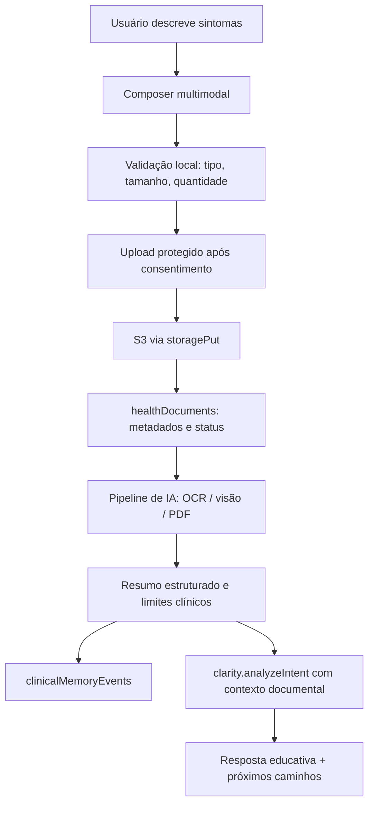

# Plano de implementação: anexos clínicos multimodais no DOUTORELO

Autor: **SIDNEY (PMO SENIUM)**

## Visão executiva

A evolução deve transformar o campo onde o usuário descreve sintomas em um **composer clínico multimodal**, capaz de receber texto, fotos, imagens, PNG, JPEG e PDF sem deixar a experiência parecer um formulário pesado. A implementação deve preservar a tese central do DOUTORELO: o usuário fala do seu jeito, o sistema organiza com segurança, salva memória longitudinal e prepara próximos passos sem diagnosticar, prescrever ou substituir atendimento profissional.

O projeto já tem a base correta para isso. Existe a tabela `healthDocuments` com `userId`, `documentType`, `title`, `fileKey`, `fileUrl`, `notes` e `documentDate`; existe também o helper `storagePut()` em `server/storage.ts`, que grava bytes no storage S3 e retorna uma URL `/manus-storage/...`; e o fluxo de clareza já passa por consentimento, IA clínica segura, criação de conversa, evento de memória e invalidação de timeline. A proposta, portanto, não é criar um módulo paralelo, mas **amadurecer o domínio existente de documentos** para que cada anexo entre na mesma memória clínica que já alimenta dashboard, timeline, mapa de clareza e continuidade.

## Princípio de blueprint

O arquivo em si não deve ir para o banco de dados. O S3 deve ser a fonte única dos bytes do documento, enquanto o banco guarda apenas metadados, vínculos, consentimento, processamento de IA e rastreabilidade. Essa separação é essencial para evitar banco pesado, permitir governança por usuário e manter o histórico clínico consultável de forma segura.

| Camada | O que fica nela | Motivo |
|---|---|---|
| **S3 via `storagePut()`** | PDF, JPEG, PNG, fotos e imagens originais. | Preserva arquivos fora do banco e usa o caminho previsto pelo template. |
| **Banco em `healthDocuments`** | `fileKey`, `fileUrl`, nome original, MIME, tamanho, hash, status, resumo, tipo inferido, vínculo com conversa e consentimento. | Permite consultar, filtrar, auditar e relacionar documentos sem armazenar bytes. |
| **`clinicalMemoryEvents`** | Evento derivado do documento, como “Exame anexado” ou “Imagem para revisar com profissional”. | Faz o documento aparecer na linha do tempo longitudinal. |
| **`healthConversations` / `clarityMaps`** | Contexto narrativo em que o usuário enviou o anexo e mapa de clareza gerado. | Mantém o documento conectado à pergunta do usuário, não como arquivo solto. |
| **IA multimodal server-side** | Extração, classificação, resumo educativo, sinais de atenção e perguntas para consulta. | Evita expor credenciais e mantém governança clínica no backend. |

## Arquitetura proposta

A implementação deve começar por um domínio chamado `documents` dentro dos contratos do backend, mas conectado ao fluxo `clarity`. O usuário poderá anexar documentos no mesmo momento em que escreve sintomas; o backend armazenará os arquivos, criará registros `healthDocuments`, processará o conteúdo e passará um resumo estruturado para a IA de clareza.

## Evolução de dados

A tabela atual `healthDocuments` deve ser expandida, não substituída. A primeira migração deve manter compatibilidade com os campos existentes e acrescentar colunas necessárias para upload real, processamento e auditoria.

| Campo proposto | Tipo conceitual | Finalidade |
|---|---:|---|
| `originalName` | texto curto | Nome enviado pelo usuário, higienizado para exibição. |
| `mimeType` | texto curto | `application/pdf`, `image/png`, `image/jpeg` e variações aceitas. |
| `sizeBytes` | inteiro | Controle de limite, auditoria e UX. |
| `sha256` | texto curto | Deduplicação e rastreabilidade sem depender do nome do arquivo. |
| `processingStatus` | enum/texto | `uploaded`, `analyzing`, `ready`, `needs_review`, `failed`, `rejected`. |
| `processingError` | texto | Mensagem segura em caso de falha. |
| `conversationId` | inteiro | Vínculo com a conversa em que o documento foi anexado. |
| `clarityMapId` | inteiro | Vínculo opcional com mapa de clareza gerado. |
| `memoryEventId` | inteiro | Vínculo com evento longitudinal derivado do documento. |
| `aiDocumentKind` | texto curto | Exame laboratorial, imagem clínica, relatório, receita, pedido, outro. |
| `aiExtractedText` | texto | Texto extraído de PDF/OCR ou descrição visual resumida. |
| `aiSummary` | texto | Resumo educativo e não diagnóstico. |
| `aiStructuredJson` | texto JSON | Campos extraídos, datas, itens identificados, confiança e limitações. |
| `safetyFlags` | texto JSON | Sinais de alerta, incertezas, baixa qualidade, documento ilegível. |
| `consentSnapshot` | texto JSON | Quais consentimentos estavam ativos no momento do envio. |

A modelagem deve evitar armazenar diagnóstico final. A IA deve salvar **interpretações auxiliares**, como “parece ser um exame laboratorial enviado para organização”, “há valores que devem ser discutidos com profissional” ou “imagem não é suficiente para avaliação segura”.

## Pipeline inteligente de IA

A IA deve operar em duas camadas. A primeira camada é documental: identificar o tipo de documento, extrair texto quando possível, resumir o conteúdo e avaliar qualidade. A segunda camada é clínica segura: usar esse resumo documental junto com a mensagem do usuário para organizar a jornada, detectar sinais de atenção e sugerir perguntas para consulta.

| Etapa | Entrada | Saída | Guardrail |
|---|---|---|---|
| **Validação** | Arquivo bruto | Aceito, rejeitado ou precisa reduzir tamanho. | Bloquear executáveis, formatos não permitidos e payloads grandes. |
| **Armazenamento** | Bytes validados | `fileKey` e `fileUrl` em S3. | Nunca salvar bytes no banco. |
| **Classificação** | MIME + nome + conteúdo | Tipo provável: exame, foto, relatório, receita, outro. | Marcar baixa confiança quando ambíguo. |
| **Extração** | PDF/imagem | Texto extraído ou descrição visual. | Se ilegível, pedir nova foto ou documento melhor. |
| **Resumo educativo** | Texto/descrição | Síntese curta e perguntas úteis. | Não diagnosticar, não prescrever, não interpretar como laudo definitivo. |
| **Integração clínica** | Mensagem + anexos | Resposta do DOUTORELO e próximos caminhos. | Manter regras de urgência, consentimento e limitação médica. |
| **Memória longitudinal** | Resultado estruturado | Eventos e documentos vinculados à timeline. | Salvar metadados rastreáveis, não conclusões perigosas. |

Para PDF, a implementação pode usar extração de texto quando o PDF tiver camada textual e fallback visual quando necessário. Para imagens e fotos, o backend deve enviar a imagem como conteúdo multimodal para o helper de IA server-side, solicitando uma resposta JSON com tipo de documento, qualidade, texto visível, resumo e limitações. A IA deve ser instruída a dizer “não consigo avaliar com segurança” quando a imagem estiver ruim, incompleta, cortada ou clinicamente inadequada.

## Contratos backend

O ideal é criar um subroteador `documents` e estender `clarity.analyzeIntent` para aceitar IDs de documentos já enviados. Assim, upload e análise documental ficam separados do raciocínio de jornada, reduzindo acoplamento e facilitando testes.

| Procedimento | Tipo | Responsabilidade |
|---|---|---|
| `documents.upload` | mutation protegida | Receber arquivo validado, gravar no S3, criar `healthDocuments` e retornar preview. |
| `documents.analyze` | mutation protegida | Processar documento específico, salvar `aiSummary`, `aiStructuredJson` e `processingStatus`. |
| `documents.listRecent` | query protegida | Mostrar documentos recentes na memória e no composer. |
| `documents.removeFromConversation` | mutation protegida | Desvincular documento antes do envio, sem apagar histórico já salvo. |
| `clarity.analyzeIntent` atualizado | mutation protegida | Receber `message` + `documentIds`, buscar resumos prontos e gerar resposta contextual segura. |

No upload, eu recomendo começar com uma mutation protegida que receba arquivo codificado com limite rígido, porque isso mantém o padrão tRPC do projeto e evita abrir uma rota REST antes da necessidade. Se quisermos suportar PDFs muito grandes depois, evoluímos para endpoint multipart dedicado, preservando a mesma tabela e o mesmo pipeline.

## UI/UX proposta: padrão internacional

A experiência não deve parecer “anexar arquivo num formulário”. Ela deve parecer um **prontuário conversacional premium**, com composição fluida, confirmação clara e sensação de segurança.

No campo principal da Home, eu colocaria uma barra inferior com o botão “Anexar exame ou foto”, mas com upload efetivo apenas depois de login e consentimento na jornada protegida. Se o usuário tentar anexar antes, a interface explica com elegância: “Para proteger seus dados de saúde, vamos abrir sua jornada segura antes de receber arquivos.” Assim evitamos coletar documento sensível fora do fluxo autenticado.

Na página de Clareza, o `AIChatBox` deve evoluir para um `HealthMultimodalComposer`, mantendo a estética atual, mas acrescentando anexos em uma bandeja visual acima do textarea. Cada item aparece como um card pequeno com ícone, miniatura quando imagem, nome truncado, tamanho, status e ação de remover.

| Elemento de UI | Comportamento proposto | Padrão visual |
|---|---|---|
| **Botão “Anexar”** | Abre seletor de arquivo com `accept="image/png,image/jpeg,application/pdf"`; em mobile, oferece câmera quando aplicável. | Ícone de clipe/câmera, borda verde suave, microcopy de privacidade. |
| **Drag and drop** | Permite soltar arquivos no composer desktop. | Overlay translúcido: “Solte exames, fotos ou PDFs aqui”. |
| **Bandeja de anexos** | Mostra cards compactos antes do envio. | Miniaturas com glassmorphism discreto, status e barra fina de progresso. |
| **Preview inteligente** | Imagens abrem modal; PDF mostra nome, páginas quando disponível e status. | Modal limpo, com alerta de que a IA organiza, não diagnostica. |
| **Estados de análise** | `Enviado`, `Lendo documento`, `Resumo pronto`, `Precisa de melhor imagem`, `Falha segura`. | Chips com cores semânticas, sem alarmismo. |
| **Consentimento contextual** | Se anexar sem consentimento, bloqueia e orienta. | Copy curto e humano, sem juridiquês. |
| **Resposta da IA** | Cita anexos como contexto: “Li o exame anexado X como documento enviado por você”. | Markdown com seções: entendido, limitações, perguntas úteis, próximos passos. |

## Regras de produto e segurança

O sistema deve aceitar inicialmente `PNG`, `JPEG/JPG` e `PDF`, com limite por arquivo e limite por mensagem. Eu implementaria o MVP com até **5 anexos por mensagem**, limite inicial de **10 MB por arquivo** e total de **25 MB por envio**, ajustável depois conforme performance real. Arquivos fora do padrão devem gerar uma explicação simples, sem erro técnico.

A IA não deve “dar diagnóstico pelo exame” nem prometer leitura médica definitiva. A linguagem deve ser: **organizar, resumir, destacar pontos para conversar, identificar limitações, sugerir perguntas e orientar urgência quando houver sinais de alerta**. Para fotos clínicas, a IA deve ser ainda mais conservadora: pode descrever o que está visível e orientar avaliação profissional, mas não deve concluir doença.

## Testes e validação

A implementação deve vir com testes antes de entrega. Eu criaria testes de contrato para validação de MIME, tamanho, armazenamento de metadados, bloqueio sem consentimento, resposta quando documento é ilegível e integração de `documentIds` no fluxo `clarity.analyzeIntent`.

| Área | Teste obrigatório |
|---|---|
| Schema | Migração mantém campos antigos e adiciona metadados sem quebrar timeline. |
| Upload | Rejeita tipos proibidos, arquivo grande e conteúdo vazio. |
| Storage | Garante que banco salva `fileKey`/`fileUrl`, nunca bytes. |
| IA | Garante JSON estruturado e fallback seguro quando o documento não é legível. |
| UI | Permite anexar, remover, ver status e enviar texto + documento. |
| Segurança | Bloqueia envio de documento sem usuário autenticado e consentimento ativo. |
| Regressão | Mantém 90+ testes existentes passando e adiciona novos testes específicos. |

## Sequência de implementação recomendada

A melhor execução é incremental. Primeiro, amadurecer banco e contratos; depois, upload e storage; depois, IA documental; por fim, UI premium e integração no fluxo de clareza. Assim o sistema fica robusto antes de ficar visualmente sofisticado.

| Ordem | Entrega | Resultado esperado |
|---:|---|---|
| 1 | Expandir `healthDocuments` e migração SQL. | Documentos passam a ter metadados, status e vínculos clínicos. |
| 2 | Criar helpers `createHealthDocument`, `updateHealthDocumentAnalysis`, `listRecentHealthDocuments`. | Backend pronto para persistência real. |
| 3 | Criar subroteador `documents`. | Upload e análise ficam contratados e testáveis. |
| 4 | Criar pipeline `server/ai/documentIntelligence.ts`. | IA entende PDFs/imagens com JSON estruturado e guardrails. |
| 5 | Atualizar `clarity.analyzeIntent` para aceitar `documentIds`. | Mensagem do usuário e anexos passam a gerar resposta integrada. |
| 6 | Evoluir `AIChatBox` para composer multimodal. | UI permite anexar sem perder fluidez conversacional. |
| 7 | Atualizar Home com CTA de anexos protegidos. | Promessa do produto fica visível desde a primeira tela, sem coletar dado sensível fora do login. |
| 8 | Atualizar Memory/Dashboard para exibir documentos processados. | Usuário vê continuidade longitudinal real. |
| 9 | Adicionar testes e rodar validações DEV. | Entrega segura, verificável e pronta para revisão visual. |

## Decisão recomendada

Minha recomendação é implementar isso como **uma capacidade central do DOUTORELO**, não como “upload de arquivo”. O nome interno pode ser `Clinical Attachments`, mas a experiência para o usuário deve ser: “conte o que está acontecendo e, se quiser, anexe exames ou fotos para eu organizar junto”.

O resultado final deve fazer o usuário sentir que o DOUTORELO entende contexto de verdade: texto, documento, imagem, histórico e intenção entram em uma mesma jornada. Ao mesmo tempo, o sistema permanece clinicamente responsável: guarda documentos no lugar correto, registra rastros, usa IA de forma limitada e transparente, e transforma cada anexo em memória útil para a próxima conversa.
