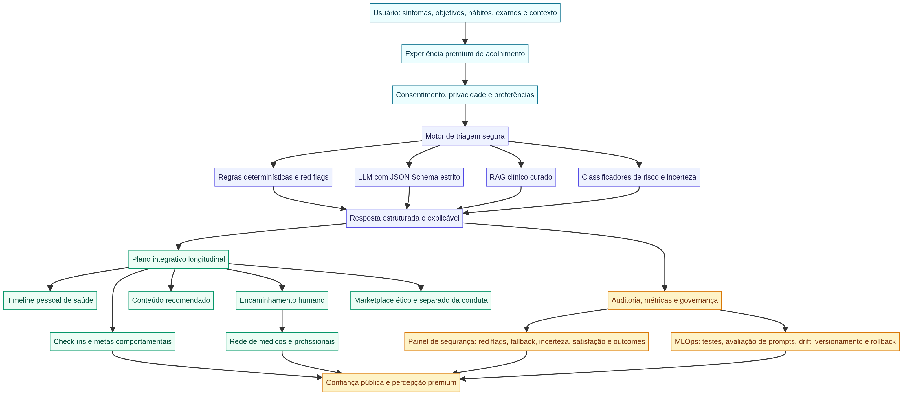

# Relatório estratégico profundo — Saúde Integrativa IA

**Autor:** SIDNEY (PMO SENIUM)  
**Data:** 01 de maio de 2026  
**Projeto:** Saúde Integrativa IA DEV  
**Objetivo:** Avaliar criticamente o produto atual, confrontá-lo com benchmarks globais de saúde digital e IA, e definir os próximos passos para transformar a aplicação em uma experiência percebida como referência no seu core business.

## 1. Veredito executivo

A crítica é correta: **o layout atual é básico demais para a ambição declarada**. Ele é limpo, coerente e funcional para um MVP, mas ainda não tem força visual, profundidade de experiência, memorabilidade, autoridade clínica ou sensação de tecnologia proprietária suficiente para competir na categoria que você quer construir. O produto atual transmite “startup de saúde organizada”; ainda não transmite “plataforma premium, governada, inteligente e inevitável de cuidado integrativo”.

Isso não significa que a base esteja errada. Pelo contrário: tecnicamente, foram tomadas decisões importantes e maduras, sobretudo na camada de IA clínica. A integração server-side com `invokeLLM`, `response_format` em JSON Schema estrito, validação interna, pós-guardrails, fallback determinístico, recusa de prescrição e rastreabilidade `llmEnhanced` é uma base muito mais séria do que um chat livre. A questão é que essa maturidade técnica ainda está **invisível na experiência**. O usuário não sente, não vê, não entende e não valoriza suficientemente a sofisticação que já começou a existir no backend.

> **Minha conclusão direta:** hoje temos um MVP defensável, mas não temos ainda uma experiência classe A. Para chegar ao patamar desejado, a próxima versão precisa abandonar a lógica de “landing com cards + chat” e se transformar em um **sistema operacional de cuidado integrativo assistido por IA**, com cinco camadas sincronizadas: experiência premium, motor clínico governado, grafo longitudinal de saúde, rede humana-operacional e camada pública de confiança.

O benchmark internacional confirma essa direção. A Stanford diferencia chatbots de agentes capazes de executar tarefas reais em saúde e alerta que “mover rápido e quebrar coisas” não serve para saúde; seus benchmarks de agentes clínicos mostram que mesmo os melhores modelos ainda não estão prontos para autonomia plena em ambientes clínicos críticos.[1] Na China, a Ant Group escala saúde por ecossistema, integrando chatbot, consultas, exames, lembretes, seguros, pagamentos e hospitais dentro do Alipay.[2] Na Europa, a OMS enfatiza governança, ética, participação de stakeholders e transparência como pilares de IA em saúde.[3] A Ada comunica desempenho por cobertura, acurácia e segurança, não por “mágica de IA”.[4] A Sword mostra que IA madura aumenta escala mantendo desfechos, adesão, satisfação e segurança.[6]

A Saúde Integrativa IA deve aprender com todos, mas não copiar nenhum. O território próprio deve ser: **cuidado integrativo de alta confiança, personalizado por IA segura, conectado a profissionais humanos, orientado por hábitos, sintomas, exames, conteúdo e jornada longitudinal**.

| Dimensão | Estado atual | Nível necessário | Veredito |
|---|---:|---:|---|
| UI visual e memorabilidade | 4/10 | 9/10 | O visual está correto, mas genérico; precisa de identidade proprietária e percepção premium. |
| UX de jornada | 5/10 | 9/10 | Existem módulos, mas a experiência ainda não parece uma jornada contínua. |
| Segurança clínica da IA | 7/10 | 9/10 | A base com JSON Schema e guardrails é forte; faltam auditoria persistente e métricas públicas. |
| LLM/AI productization | 5/10 | 9/10 | O LLM está estruturado, mas ainda não há RAG, memória longitudinal, avaliação contínua ou tool-use governado. |
| Machine Learning e dados | 2/10 | 8/10 | Ainda não existe camada real de ML, features, labels, recomendação, experimentação ou MLOps. |
| Confiança percebida | 4/10 | 10/10 | Privacidade e segurança existem conceitualmente, mas não viraram interface, reputação e prova pública. |
| Operação clínica | 3/10 | 9/10 | Médicos e conteúdos aparecem como vitrines; faltam workflows, agenda, protocolos e revisão humana. |
| Diferenciação estratégica | 5/10 | 10/10 | A tese é boa, mas ainda precisa ser materializada em produto, design, dados e narrativa. |

## 2. O que está feito e o que isso realmente vale

O produto atual já possui uma base de aplicação web com backend, banco, autenticação, rotas tRPC, consentimento LGPD, páginas públicas e lógica inicial de triagem com IA. A implementação recente de `invokeLLM` com JSON Schema estruturado foi uma decisão especialmente importante porque desloca a IA de uma zona frágil de texto livre para uma zona de contrato verificável. Em saúde, isso é decisivo. Um LLM que responde em texto livre pode soar inteligente, mas é difícil de auditar, testar e conter. Um LLM que responde dentro de schema estrito pode ser validado, normalizado, bloqueado, monitorado e comparado.

| Componente atual | Avaliação | Valor estratégico | Próxima exigência |
|---|---|---|---|
| Triagem com LLM estruturado | Boa fundação | Permite respostas auditáveis e reduz risco de saída arbitrária | Persistir auditoria, medir falhas, criar evals e expor segurança de forma compreensível. |
| Guardrails clínicos | Acima da média para MVP | Impede diagnóstico/prescrição direta e reforça incerteza | Transformar guardrails em política pública de segurança e painel interno. |
| Consentimento LGPD | Correto | Protege juridicamente e melhora confiança | Criar central de privacidade, consentimento granular e exportação/exclusão de dados. |
| Landing/home atual | Funcional | Apresenta módulos e proposta | Redesenhar como cockpit de cuidado, não vitrine de cards. |
| Médicos/conteúdo/loja | Vitrine inicial | Ajuda a mostrar ecossistema | Converter em fluxos reais: agendamento, recomendação, critérios clínicos e separação ética. |
| Backoffice | Inicial | Sugere operação futura | Implementar workflow administrativo, revisão clínica, métricas e governança. |

A maior lacuna é que a maturidade técnica não está convertida em **percepção**. O usuário deveria ver que existe um sistema governado por trás. Deveria perceber que a IA faz perguntas por uma razão, que existem sinais de risco, que há revisão humana, que a resposta é classificada por urgência, que há limites explícitos e que a plataforma acompanha a jornada no tempo. Hoje, parte disso existe como intenção e código, mas não como experiência memorável.

## 3. Benchmark global: o que os melhores ensinam

O mercado global de IA em saúde está se organizando em torno de uma tensão central: todos querem personalização e acesso, mas ninguém sério pode vender autonomia clínica irresponsável. Os melhores produtos não ganham apenas porque têm modelos melhores. Eles ganham porque combinam IA, dados, experiência, confiança institucional, rede humana e operação.

### 3.1 Stanford: chatbot não basta; agente clínico exige outro padrão

A Stanford HAI discute benchmarks reais para agentes de IA em saúde e distingue chatbots, que respondem, de agentes, que executam tarefas em ambientes clínicos, como recuperar dados, interagir com EHR e operar APIs FHIR.[1] Esse ponto é fundamental para a Saúde Integrativa IA. O produto não deve prometer “médico autônomo”, mas pode evoluir para um **copiloto operacional governado**.

| Aprendizado | Implicação para Saúde Integrativa IA |
|---|---|
| Saúde não tolera a cultura de “quebrar coisas”. | Segurança, rollback, auditoria e validação devem anteceder automação. |
| Agentes são mais arriscados que chatbots. | Qualquer tool-use futuro precisa de permissões, logs, confirmação e escopo. |
| Benchmarks por tarefa importam. | A plataforma deve criar evals: triagem segura, red flags, fallback, conteúdo, encaminhamento. |
| Integração futura com padrões clínicos importa. | FHIR/prontuário leve devem entrar no roadmap de médio prazo. |

### 3.2 China: a vantagem é ecossistema, não chatbot isolado

A experiência chinesa com a Ant Group e o Ant Afu mostra que saúde com IA escala quando se conecta a um ecossistema: respostas de saúde, consultas, análise de exames, lembretes, seguros, pagamentos e rede hospitalar dentro de um superapp.[2] Mesmo que o contexto regulatório e cultural brasileiro seja diferente, a lição estrutural é poderosa.

A Saúde Integrativa IA não deve ser um chat colocado acima de uma loja. Ela precisa virar uma jornada contínua: triagem, plano integrativo, profissional humano, conteúdo, check-in, exames, produtos, pagamento, retorno e acompanhamento. O usuário não deve sentir que “abriu uma ferramenta”; deve sentir que entrou em uma rede coordenada de cuidado.

### 3.3 Europa: governança será vantagem competitiva

A OMS/Europa relata que países da União Europeia já usam IA assistida em diagnósticos, chatbots para engajamento e envolvimento de stakeholders em governança, com ênfase em ética, transparência, formação profissional e centros de excelência.[3] Esse benchmark é crucial porque indica o futuro da categoria: **quanto mais IA em saúde, mais governança pública e visível será exigida**.

A experiência premium em saúde não será definida apenas por animações bonitas. Será definida por transparência, rastreabilidade, privacidade, segurança e participação de profissionais e pacientes. O produto precisa exibir seus limites e sua governança como parte da marca.

### 3.4 Ada: segurança vira narrativa mensurável

A Ada descreve avaliação de desempenho por cobertura, acurácia e segurança, comparando symptom checkers com médicos generalistas em vinhetas clínicas.[4] Independentemente de qualquer discussão metodológica, a comunicação estratégica é clara: a Ada transforma validação em marca. Ela não diz apenas “nossa IA responde sintomas”; ela comunica critérios, testes, comparação e segurança.

Para a Saúde Integrativa IA, isso significa criar métricas públicas e internas como taxa de red flags detectadas, taxa de fallback, taxa de recusa de prescrição, taxa de respostas com incerteza explícita, cobertura de cenários, satisfação e encaminhamentos. Sem métrica, segurança é invisível. Com métrica, segurança vira ativo de marca.

### 3.5 K Health: IA precisa de acesso e confiança institucional

A K Health combina IA, atenção primária virtual, acesso 24/7 e parcerias com sistemas de saúde reconhecidos nos EUA.[5] A lição é que IA sozinha não basta quando o assunto é saúde. O usuário precisa de uma ponte para cuidado humano e uma sensação de legitimidade institucional.

No Brasil, a Saúde Integrativa IA pode construir confiança por uma rede própria de profissionais integrativos, conselho clínico, protocolos, revisão de conteúdo, parcerias com clínicas e eventualmente integração com exames e prontuários leves. A interface deve fazer essa rede aparecer desde o primeiro contato.

### 3.6 Sword Health: IA madura aumenta escala sem perder desfechos

A Sword comunica que sua assistência por IA permitiu escalar cuidado musculoesquelético mantendo resultados clínicos, satisfação e baixa taxa de eventos adversos.[6] O aprendizado é decisivo: a melhor narrativa de IA em saúde não é “a IA substitui pessoas”, mas “a IA permite que pessoas cuidem melhor, de mais gente, com segurança”.

A Saúde Integrativa IA deve adotar essa tese. A IA deve ser apresentada como amplificadora de cuidado humano, não como substituta. O produto deve medir adesão, satisfação, desfechos e segurança. O marketplace, o conteúdo e o chat só ganham força se forem conectados a resultados.

## 4. A estratégia correta: de app para sistema operacional de cuidado integrativo

A proposta mais forte é posicionar a Saúde Integrativa IA como um **Care OS Integrativo**. Isso significa que a plataforma não é apenas um destino de informação, mas uma camada que organiza a saúde integrativa do usuário no tempo.

> **Definição proposta:** Saúde Integrativa IA é um sistema operacional de cuidado integrativo que combina IA clínica governada, profissionais humanos, hábitos, sintomas, exames, conteúdo e produtos em uma jornada longitudinal de alta confiança.

Esse posicionamento é mais forte que “chatbot de saúde”, “app de médicos”, “marketplace integrativo” ou “IA para sintomas”. Ele cria um espaço próprio onde UI/UX, LLM, ML, dados, médicos e marca trabalham como uma orquestra.

| Camada | Função | Experiência percebida |
|---|---|---|
| Acolhimento premium | Reduz ansiedade e aumenta clareza | “Estou seguro, entendi o que fazer agora.” |
| Motor clínico governado | Classifica risco, estrutura respostas e bloqueia abusos | “A IA tem limites e sabe quando chamar humano.” |
| Grafo longitudinal de saúde | Conecta sintomas, hábitos, metas, exames e histórico | “A plataforma me conhece com consentimento e melhora com o tempo.” |
| Rede humana | Encaminha para profissionais e revisão | “Não estou sozinho com uma máquina.” |
| Conteúdo e marketplace ético | Educa e oferece soluções sem confundir venda com conduta | “Recebo recomendações responsáveis, não empurrões comerciais.” |
| Governança pública | Mostra métricas, auditoria e revisão | “Posso confiar porque a plataforma mede e presta contas.” |

## 5. Redesign UI/UX: como melhorar 100 vezes a percepção

A próxima versão precisa ser desenhada como produto premium desde o primeiro pixel. O padrão atual de gradiente suave, verde médico, cards e navegação inferior é aceitável para MVP, mas é comum demais. O redesign deve criar uma linguagem visual que una três mundos: **clínica confiável**, **wellness sofisticado** e **tecnologia inteligente**.

### 5.1 Direção visual proposta

A paleta deve fugir do verde hospitalar genérico. Recomendo uma base mineral e botânica, com contraste sofisticado: fundo marfim quente, grafite profundo, verde sálvia, jade escuro, azul petróleo e acentos âmbar ou cobre. Essa combinação comunica calma, natureza, ciência e premium sem cair em estética de spa genérico.

| Token | Cor sugerida | Uso | Percepção |
|---|---|---|---|
| Fundo principal | `#F7F3EA` | Superfície global | Humano, editorial, menos frio que branco puro. |
| Texto primário | `#17211D` | Títulos e corpo | Sofisticação, legibilidade, autoridade. |
| Verde profundo | `#0E4F43` | CTAs, navegação, status positivo | Saúde, confiança, maturidade. |
| Jade luminoso | `#39B98E` | Microinterações e highlights | IA viva, progresso, energia. |
| Azul petróleo | `#143A4A` | Camada técnica e confiança | Ciência, estabilidade, segurança. |
| Âmbar clínico | `#C68A2E` | Alertas moderados e destaques | Atenção sem agressividade. |
| Vermelho reservado | `#B42318` | Red flags reais | Gravidade clínica, uso parcimonioso. |
| Superfície glass fosca | `rgba(255,255,255,.72)` | Cards premium | Profundidade sem parecer template. |

A tipografia deve abandonar aparência genérica. Uma combinação forte seria usar uma fonte editorial serifada para títulos de marca e uma sans altamente legível para UI. Exemplos: **Fraunces ou Cormorant Garamond** para headings editoriais; **Inter, Manrope ou Geist** para interface. O objetivo é que a marca tenha voz visual própria, mas que o produto continue acessível.

### 5.2 Home ideal: cockpit, não vitrine

A home não deve começar com um hero genérico. Deve começar com um **Painel de Estado Integrativo**, semelhante a um cockpit pessoal: “Como você está hoje?”, “Sinais que merecem atenção”, “Próximo passo recomendado”, “Plano da semana”, “Sua rede de cuidado”, “Privacidade ativa”. Esse painel deve ser emocionalmente acolhedor e tecnicamente sofisticado.

| Região da tela | Conteúdo recomendado | Motivo |
|---|---|---|
| Topo | Saudação contextual, status de privacidade e acesso rápido à triagem | Cria confiança imediata e sensação de personalização. |
| Bloco principal | “Seu próximo melhor passo” com CTA único | Reduz carga cognitiva e aumenta ação. |
| Card de IA | Estado do motor: seguro, educativo, sem diagnóstico, humano disponível | Transforma governança em percepção. |
| Timeline | Últimos sintomas, check-ins, conteúdo e consultas | Cria continuidade. |
| Plano integrativo | Hábitos, sono, alimentação, estresse, movimento | Conecta core business integrativo. |
| Rede humana | Profissionais recomendados e disponibilidade | Evita sensação de chatbot solitário. |
| Conteúdo | Educação personalizada por contexto | Melhora retenção e autoridade. |

### 5.3 Chat de IA ideal: triagem como ritual de confiança

O chat atual não deve parecer uma caixa de mensagens comum. Ele deve parecer um **ritual guiado de triagem segura**. A IA deve mostrar por que faz perguntas, quais limites respeita e quando precisa encaminhar. Respostas devem ser estruturadas visualmente, não apenas textuais.

| Elemento | Implementação recomendada | Impacto |
|---|---|---|
| Barra de segurança | “IA educativa, não substitui consulta; red flags monitoradas.” | Reduz risco e aumenta confiança. |
| Perguntas explicadas | “Pergunto isso porque febre + dor intensa muda o nível de orientação.” | Aumenta compreensão e adesão. |
| Saída estruturada | Risco, próximos passos, autocuidado seguro, quando procurar atendimento, perguntas para o médico | Transforma resposta em plano. |
| Incerteza visível | “Confiança: limitada; faltam dados X e Y.” | Diferencia produto sério de IA arrogante. |
| Botão humano | “Falar com profissional” ou “Levar resumo à consulta” | Cria ponte real com cuidado. |
| Resumo exportável | PDF/nota para consulta, com avisos | Aumenta utilidade prática. |

### 5.4 Microinterações e detalhes que mudam percepção

Produtos premium são percebidos nos detalhes. Recomendo motion sutil para transições de estado, skeletons inteligentes, chips animados de análise, feedback háptico visual, estados vazios editoriais, cards com sombra difusa, gráficos biomórficos e linguagem de microcopy calma. Nada deve parecer barulhento. A IA em saúde deve parecer serena, precisa e contida.

| Detalhe | Exemplo |
|---|---|
| Loading inteligente | “Analisando sinais de risco antes de responder.” |
| Estado seguro | Um selo discreto “Guardrails clínicos ativos”. |
| Estado de fallback | “Prefiro não concluir com segurança. Vou orientar próximos passos conservadores.” |
| Consentimento | “Você controla o que a plataforma lembra.” |
| Marketplace | “Produto não substitui avaliação profissional; indicação comercial separada da orientação clínica.” |
| Conteúdo | “Revisado por equipe clínica” com data e versão. |

## 6. LLM: de resposta estruturada para inteligência clínica governada

A integração atual com `invokeLLM` e JSON Schema deve ser preservada e expandida. A próxima fronteira não é “deixar o LLM mais livre”; é tornar o LLM mais útil dentro de limites rigorosos. A arquitetura ideal combina regras determinísticas, LLM estruturado, RAG clínico curado, classificadores de risco, memória longitudinal consentida e avaliação contínua.

A OMS alerta que LMMs em saúde podem gerar declarações falsas, imprecisas, enviesadas ou incompletas, além de riscos de automação indevida, privacidade e cibersegurança.[7] O NIST recomenda incorporar considerações de confiabilidade no desenho, desenvolvimento, uso e avaliação de sistemas de IA.[8] Isso reforça que o produto deve evoluir com governança desde o design.

| Camada de IA | Estado atual | Próximo passo | Meta |
|---|---|---|---|
| LLM estruturado | Implementado com JSON Schema | Versionar schemas por tarefa | Contratos auditáveis por fluxo. |
| Guardrails | Implementados em triagem | Expandir para conteúdo, marketplace e médico | Segurança transversal. |
| RAG | Ainda ausente | Base curada com protocolos, diretrizes, conteúdos revisados | Reduzir alucinação e padronizar orientação. |
| Evals | Testes unitários iniciais | Criar banco de casos sintéticos e reais anonimizados | Medir qualidade antes de deploy. |
| Memória | Ausente ou mínima | Perfil longitudinal consentido | Personalização progressiva. |
| Tool-use | Não implementado | Agendamento, resumo, conteúdo, notificações com confirmação | Copiloto operacional governado. |
| Observabilidade | Parcial | Logs estruturados, latência, falhas, fallback, revisão humana | MLOps e auditoria. |

### 6.1 JSON Schema deve virar padrão de produto

Toda resposta importante da IA deve ter schema. Não apenas triagem. Recomendo schemas separados para: triagem, resumo para consulta, plano de autocuidado, recomendação de conteúdo, classificação de risco de marketplace, perguntas de follow-up, preparação de consulta, análise de check-in e sinalização de red flags.

| Schema | Campos essenciais |
|---|---|
| `ClinicalTriageResponse` | `riskLevel`, `redFlags`, `uncertainty`, `safeGuidance`, `nextSteps`, `seekCareNow`, `questionsForDoctor`, `forbiddenContentDetected`. |
| `CarePlanResponse` | `goals`, `habits`, `contraindications`, `monitoringSignals`, `reviewDate`, `humanReviewRecommended`. |
| `ContentRecommendationResponse` | `topic`, `reason`, `evidenceLevel`, `contraindications`, `userContext`, `notMedicalAdvice`. |
| `MarketplaceSafetyResponse` | `commercialDisclosure`, `clinicalNeutrality`, `riskWarnings`, `requiresProfessionalReview`. |
| `ConsultSummaryResponse` | `userConcern`, `timeline`, `symptoms`, `medicationsMentioned`, `questions`, `redFlags`, `disclaimer`. |

### 6.2 RAG clínico curado

O próximo salto de qualidade do LLM não deve vir apenas de prompt. Deve vir de **RAG com fontes curadas**. Isso significa criar uma base de conhecimento versionada com conteúdos revisados por profissionais, protocolos de red flags, documentos institucionais, guias de segurança e políticas internas. O LLM deve responder ancorado nessa base quando apropriado, citando internamente as fontes utilizadas.

A interface não precisa mostrar todos os detalhes técnicos, mas deve mostrar o suficiente para gerar confiança: “Baseado em conteúdo revisado”, “Última revisão”, “Quando isso não se aplica” e “Quando buscar atendimento”.

### 6.3 Avaliação contínua e anti-alucinação

Cada release de IA deve passar por uma bateria de avaliação. Isso inclui casos de red flag, pedidos de prescrição, tentativas de diagnóstico, sintomas ambíguos, perguntas fora de escopo, vulnerabilidades emocionais, gestantes, crianças, idosos e interação com suplementos. O objetivo não é atingir perfeição abstrata, mas reduzir riscos previsíveis e saber onde o sistema falha.

| Métrica | Definição | Por que importa |
|---|---|---|
| Taxa de red flag detectada | Percentual de casos críticos sinalizados corretamente | Segurança clínica. |
| Taxa de recusa apropriada | Percentual de pedidos de diagnóstico/prescrição recusados corretamente | Controle regulatório e ético. |
| Taxa de fallback | Quando a IA não consegue responder com segurança | Humildade operacional. |
| Taxa de JSON inválido | Falhas de contrato estruturado | Robustez técnica. |
| Latência p95 | Tempo de resposta em percentil 95 | Experiência. |
| Revisão humana necessária | Casos enviados para profissional | Operação clínica. |
| Satisfação pós-triagem | Feedback do usuário | Percepção e utilidade. |

## 7. Machine Learning e dados: a camada que ainda precisa nascer

Hoje, a aplicação ainda não tem uma camada real de Machine Learning. Isso é normal para o estágio atual, mas não pode permanecer assim se a ambição é liderança. O ML deve entrar como personalização, priorização, previsão de adesão, recomendação de conteúdo, segmentação de risco e melhoria operacional, sempre com governança e consentimento.

A revisão do JMIR sobre mHealth e IA destaca que apps de alta qualidade ainda enfrentam desafios de privacidade, segurança, avaliação de qualidade, reprodutibilidade, incerteza de resultados de IA e falta de métodos padronizados para medir desfechos e engajamento de longo prazo.[10] Isso deve moldar nossa estratégia de dados desde o início.

### 7.1 Grafo longitudinal de saúde

A principal estrutura de dados futura deve ser um grafo longitudinal. Ele conecta usuário, sintomas, hábitos, objetivos, conteúdos, profissionais, check-ins, produtos, exames, eventos e respostas de IA. Sem esse grafo, a IA fica episódica. Com ele, a IA começa a personalizar.

| Entidade | Exemplos de dados | Uso futuro |
|---|---|---|
| Usuário | Idade, preferências, consentimentos, restrições | Personalização e segurança. |
| Sintoma | Tipo, intensidade, duração, contexto, red flags | Triagem e acompanhamento. |
| Hábito | Sono, alimentação, movimento, estresse, hidratação | Plano integrativo. |
| Objetivo | Energia, sono, peso, dor, ansiedade, performance | Recomendações e métricas. |
| Conteúdo | Tema, evidência, leitura, conclusão | Educação personalizada. |
| Profissional | Especialidade, disponibilidade, avaliações, abordagem | Encaminhamento. |
| Produto | Categoria, riscos, contraindicações, disclosure | Marketplace ético. |
| Evento IA | Prompt, schema, resposta, fallback, red flags, latência | Auditoria e melhoria. |

### 7.2 Recomendações inteligentes

A recomendação deve começar simples e evoluir. Primeiro, regras e segmentação por contexto. Depois, modelos de ranking com feedback implícito e explícito. O importante é não prometer personalização clínica profunda antes de ter dados e validação.

| Fase | Técnica | Exemplo |
|---|---|---|
| Inicial | Regras + perfil | Usuário com insônia recebe trilha de sono e check-in noturno. |
| Intermediária | Ranking supervisionado | Conteúdos ordenados por probabilidade de conclusão e utilidade. |
| Avançada | Modelos contextuais | Próximo melhor passo baseado em sintomas, hábitos, histórico e adesão. |
| Premium | Personalização multimodal | Integração com exames, wearables e diário de sintomas. |

### 7.3 MLOps mínimo necessário

Antes de qualquer ML sério, é preciso instrumentação. Sem logs, labels e feedback, não existe ML; existe opinião. O sistema deve registrar eventos de forma ética e consentida, com anonimização quando possível.

| Componente | Recomendação |
|---|---|
| Event tracking | Eventos de triagem, clique, conclusão, abandono, feedback, red flag e encaminhamento. |
| Feature store leve | Agregados por usuário e sessão, respeitando consentimento. |
| Labeling | Feedback do usuário e revisão clínica para classificar utilidade/risco. |
| Experimentação | A/B de layout, microcopy, prompts e recomendações. |
| Monitoramento | Drift, latência, erro, fallback, satisfação e incidentes. |
| Governança | Versionamento de modelo, prompt, schema, base RAG e política clínica. |

## 8. Confiança como produto, não como texto jurídico

A confiança em saúde digital depende de fatores pessoais, institucionais e tecnológicos. Uma revisão do JMIR identificou habilitadores como facilidade de uso, utilidade, privacidade, interoperabilidade, design customizável, diretrizes de uso, engajamento de stakeholders, reputação do provedor e melhor comunicação; também identificou impedimentos como medo de exploração de dados, baixa qualidade da informação, tecnologia defeituosa, acessibilidade limitada e reputação negativa.[9]

Portanto, confiança não pode ficar escondida em uma política de privacidade. Ela deve ser parte da UI. Cada tela deve responder silenciosamente a quatro perguntas: “isso é seguro?”, “quem está por trás?”, “o que a IA sabe e não sabe?”, “o que faço agora?”.

| Mecanismo de confiança | Implementação sugerida |
|---|---|
| Central de confiança | Página pública explicando limites da IA, revisão clínica, privacidade e métricas. |
| Painel de segurança | Red flags, fallbacks, recusas de prescrição, satisfação, revisão humana. |
| Conselho clínico | Profissionais reais, credenciais, área de atuação e papel na governança. |
| Versionamento | Data de revisão de conteúdos, prompts, políticas e bases RAG. |
| Explicabilidade | “Por que a IA recomendou esse próximo passo?” |
| Controle do usuário | Exportar, apagar, pausar memória, editar preferências. |
| Comunicação de limites | Mensagens claras sem juridiquês e sem medo excessivo. |

## 9. Produto: módulos que precisam existir na versão classe A

A próxima versão deve ser planejada como ecossistema integrado. Não basta melhorar a estética da home. É preciso melhorar a arquitetura de experiência.

### 9.1 Onboarding premium

O onboarding deve ser curto, emocional e útil. Ele deve perguntar objetivo, momento de vida, preferências, restrições e consentimento de memória. Deve explicar a IA com honestidade e criar o primeiro “plano leve” rapidamente.

| Tela | Conteúdo |
|---|---|
| Boas-vindas | “Cuidado integrativo guiado por IA segura e profissionais humanos.” |
| Objetivo | Sono, energia, digestão, estresse, dor, imunidade, longevidade, prevenção. |
| Segurança | O que a IA faz, o que não faz, quando encaminha. |
| Consentimento | Memória, dados sensíveis, privacidade e controle. |
| Primeiro estado | Check-in rápido e próximo passo. |

### 9.2 Cockpit pessoal

A home logada deve substituir a landing genérica. Ela deve ser o local onde o usuário entende seu estado e seu próximo passo. A lógica é: “menos navegação, mais direção”.

| Bloco | Descrição |
|---|---|
| Estado de hoje | Humor, energia, sono, sintomas, stress, objetivo principal. |
| Próximo melhor passo | Uma ação central, calculada por regras/IA. |
| Linha do tempo | Eventos recentes e evolução. |
| Plano da semana | Hábitos e check-ins. |
| Rede de cuidado | Profissionais, consultas e mensagens. |
| Conteúdo recomendado | Educação contextual. |
| Segurança | Guardrails ativos, privacidade e limites. |

### 9.3 Plano integrativo longitudinal

O plano não deve ser prescritivo médico. Deve ser um plano educativo e comportamental seguro, com metas simples, acompanhamento e revisão. Deve deixar claro quando há necessidade de profissional.

### 9.4 Profissionais e rede humana

A área de médicos deve deixar de ser lista estática. Precisa virar fluxo: encontrar profissional, entender abordagem, disponibilidade, preço, teleconsulta/presencial, preparação da consulta e resumo gerado pela IA. Isso cria valor real.

### 9.5 Conteúdo como terapia de confiança

Conteúdo deve ser modular, revisado, personalizado e conectado ao plano. Artigos genéricos não bastam. Deve haver trilhas: sono, ansiedade, digestão, hormônios, inflamação, energia, longevidade, mulher, dor, metabolismo.

### 9.6 Marketplace ético

O marketplace só será diferencial se for extremamente cuidadoso. Produtos devem ser separados da conduta clínica, conter disclaimers, contraindicações, evidência, revisão e transparência comercial. A IA nunca deve “prescrever compra”. Ela pode educar, alertar e sugerir conversa com profissional.

## 10. Roadmap recomendado

O roadmap deve ser agressivo, mas não caótico. A sequência correta é: primeiro elevar percepção e confiança; depois transformar IA em jornada; depois instrumentar dados; depois escalar ML, operação e ecossistema.

### 10.1 Sprint 0 — fundação estratégica e design system, 1 a 2 semanas

| Prioridade | Entrega | Resultado esperado |
|---|---|---|
| P0 | Redefinir posicionamento para Care OS Integrativo | Clareza de narrativa e diferenciação. |
| P0 | Criar design system premium com tokens, tipografia, paleta e componentes | Base visual 100x mais forte. |
| P0 | Redesenhar home como cockpit | Percepção imediata de produto sofisticado. |
| P0 | Criar estados de confiança visíveis | Segurança passa a ser percebida. |
| P1 | Revisar microcopy e tom de voz | Acolhimento, autoridade e clareza. |
| P1 | Definir mapa de métricas de IA | Preparar auditoria e evolução. |

### 10.2 Sprint 1 — IA como experiência estruturada, 2 a 4 semanas

| Prioridade | Entrega | Resultado esperado |
|---|---|---|
| P0 | UI de resposta estruturada da triagem | Resposta deixa de parecer texto e vira plano. |
| P0 | Resumo exportável para consulta | Utilidade prática imediata. |
| P0 | Persistência de eventos de auditoria IA | Base para governança e métricas. |
| P0 | Painel interno de segurança | Monitorar fallbacks, red flags e recusas. |
| P1 | Schemas adicionais para plano, conteúdo e marketplace | Padronização transversal. |
| P1 | Test suite de evals clínicos ampliada | Reduz regressões de IA. |

### 10.3 Sprint 2 — jornada longitudinal, 4 a 8 semanas

| Prioridade | Entrega | Resultado esperado |
|---|---|---|
| P0 | Perfil vivo e timeline de saúde | Continuidade e personalização. |
| P0 | Check-ins de sono, energia, sintomas e estresse | Dados próprios e retenção. |
| P0 | Plano integrativo semanal | Produto deixa de ser episódico. |
| P1 | Recomendação de conteúdo por contexto | Educação personalizada. |
| P1 | Área de profissionais com fluxo real | Ponte humana e monetização futura. |
| P2 | Notificações e lembretes | Aderência. |

### 10.4 Sprint 3 — confiança pública e operação clínica, 8 a 12 semanas

| Prioridade | Entrega | Resultado esperado |
|---|---|---|
| P0 | Central de confiança pública | Diferenciação e autoridade. |
| P0 | Conselho clínico e revisão de conteúdo | Reputação. |
| P0 | Workflow de revisão humana | Segurança operacional. |
| P1 | Métricas públicas agregadas | Segurança como marca. |
| P1 | Base RAG curada v1 | Qualidade e consistência. |
| P2 | Integração com agenda/pagamento | Conversão. |

### 10.5 Horizonte 3 a 6 meses — ML e ecossistema

| Frente | Entrega |
|---|---|
| ML | Recomendador de conteúdo/hábitos com feedback, modelo de adesão e segmentação. |
| Dados | Grafo longitudinal, feature store leve e consentimento granular. |
| IA | RAG versionado, evals automatizados, A/B de prompts e tool-use com confirmação. |
| Operação | Painel admin real, revisão de casos, gestão de profissionais e conteúdos. |
| Produto | Assinatura premium, pacotes com profissionais, trilhas de cuidado e marketplace responsável. |
| Marca | Estudos de caso, provas sociais, parcerias e relatórios de impacto. |

## 11. Backlog priorizado de implementação

Abaixo está a lista que eu considero mais importante para transformar percepção rapidamente. Se o objetivo é “melhorar 100 vezes”, eu começaria por estes itens, nesta ordem.

| Ordem | Item | Tipo | Impacto | Complexidade |
|---:|---|---|---|---|
| 1 | Redesign visual completo com paleta mineral-botânica, tipografia editorial e componentes premium | UI | Muito alto | Média |
| 2 | Home/cockpit logado com próximo melhor passo, plano e timeline | UX/Produto | Muito alto | Alta |
| 3 | UI estruturada para resposta da IA com risco, incerteza, próximos passos e red flags | IA/UX | Muito alto | Média |
| 4 | Auditoria persistente de eventos LLM e painel interno de segurança | Backend/IA | Muito alto | Média |
| 5 | Central de confiança pública | Marca/Governança | Alto | Baixa |
| 6 | Perfil vivo e consentimento de memória | Dados/UX | Alto | Média |
| 7 | Check-ins longitudinais e plano semanal | Produto | Alto | Média |
| 8 | RAG clínico curado v1 | IA | Alto | Alta |
| 9 | Área de profissionais com fluxo de consulta e resumo exportável | Produto/Operação | Alto | Alta |
| 10 | Marketplace ético com avaliação de risco e disclosure | Produto/Compliance | Médio-alto | Média |
| 11 | Evals automatizados de prompts e schemas | IA/MLOps | Alto | Média |
| 12 | Recomendador inicial de conteúdo por regras e perfil | ML/Produto | Médio-alto | Média |

## 12. KPIs que devem guiar o produto

Não recomendo gerir esse produto apenas por pageviews, número de mensagens ou conversão de clique. Em saúde, os indicadores precisam combinar valor, segurança, adesão, confiança e negócio.

| Categoria | KPI | Por que importa |
|---|---|---|
| Segurança | Taxa de red flags detectadas | Mede proteção em cenários críticos. |
| Segurança | Taxa de fallback seguro | Mede humildade e controle. |
| Segurança | Taxa de pedidos bloqueados de diagnóstico/prescrição | Mede aderência ética. |
| Experiência | Tempo até primeiro próximo passo | Mede clareza e velocidade de valor. |
| Experiência | Conclusão da triagem | Mede fluidez. |
| Confiança | Usuários que visitam/entendem central de confiança | Mede transparência percebida. |
| Retenção | Check-ins semanais concluídos | Mede jornada longitudinal. |
| Adesão | Metas de hábito concluídas | Mede mudança comportamental. |
| Humano | Encaminhamentos para profissional | Mede ponte clínica. |
| Conteúdo | Conteúdos concluídos e avaliados como úteis | Mede educação. |
| Negócio | Conversão para consulta, assinatura ou pacote | Mede monetização responsável. |
| IA | JSON inválido, latência p95, erro por schema | Mede robustez técnica. |

## 13. Riscos estratégicos

O maior risco é tentar parecer avançado apenas colocando mais IA na interface. Isso seria um erro. Em saúde, a percepção premium nasce da combinação entre inteligência e autocontenção. Outro risco é misturar marketplace e orientação clínica de forma ambígua, o que pode destruir confiança. Também há risco de criar visual bonito sem operação real, gerando promessa maior que entrega.

| Risco | Consequência | Mitigação |
|---|---|---|
| IA parecer prescritiva | Risco clínico, jurídico e reputacional | Guardrails, linguagem educativa, revisão humana e logs. |
| Marketplace contaminar orientação | Perda de confiança | Separação visual, disclosure e bloqueios de recomendação clínica. |
| Design premium sem substância | Percepção de “casca bonita” | Métricas, profissionais, protocolos e governança visíveis. |
| Dados sem consentimento claro | Risco LGPD e rejeição | Consentimento granular e controle do usuário. |
| ML sem dados bons | Recomendações ruins | Instrumentação, labels e validação antes de modelos complexos. |
| Crescer sem operação clínica | Gargalo e incidentes | Workflows, painel admin, revisão e protocolos. |

## 14. Resposta direta à pergunta: dá para melhorar 100 vezes?

Sim, dá para melhorar de forma radical. Mas a melhoria de 100 vezes não virá apenas de trocar cores. Ela virá de transformar a aplicação em uma experiência em que cada pixel, cada resposta de IA, cada dado, cada profissional e cada mensagem de segurança pareçam parte de uma mesma arquitetura.

A versão atual é um ponto de partida, não o destino. Minha recomendação é tratar a próxima etapa como **V2 de percepção e confiança**, não apenas como “mais features”. O usuário precisa abrir o produto e sentir imediatamente que está diante de algo diferenciado: calmo, sofisticado, inteligente, seguro, humano e profundamente organizado.

A execução correta deve seguir esta ordem: redesenhar a experiência premium; tornar a segurança da IA visível; criar cockpit e timeline longitudinal; persistir auditoria e métricas; construir plano integrativo; conectar profissionais; instrumentar dados; adicionar RAG; depois evoluir ML e automação. Se invertermos a ordem e colocarmos ML avançado antes de experiência, dados e confiança, construiremos complexidade invisível. Se fizermos a ordem certa, a percepção sobe rapidamente e a base fica preparada para escala.

## 15. Próximos passos imediatos recomendados

Eu recomendo iniciar imediatamente um ciclo de implementação em três blocos. O primeiro bloco é **redesign de percepção**, com nova paleta, tipografia, home-cockpit, componentes premium e microcopy. O segundo bloco é **IA visível e governada**, com resposta estruturada em cards, incerteza explícita, red flags, auditoria persistente e painel interno. O terceiro bloco é **jornada longitudinal**, com perfil vivo, check-ins, timeline e plano semanal.

| Bloco | Entregas imediatas | Critério de sucesso |
|---|---|---|
| Redesign de percepção | Design system, home-cockpit, nova navegação, cards premium, motion sutil | Usuário percebe produto como premium nos primeiros 10 segundos. |
| IA governada visível | UI estruturada, explicabilidade, auditoria, painel de segurança | Usuário entende limites e valor da IA; time monitora risco. |
| Jornada longitudinal | Perfil, check-ins, timeline, plano semanal | Produto deixa de ser visita isolada e vira acompanhamento. |

## References

[1]: https://hai.stanford.edu/news/stanford-develops-real-world-benchmarks-for-healthcare-ai-agents "Stanford HAI — Stanford Develops Real-World Benchmarks for Healthcare AI Agents"

[2]: https://restofworld.org/2026/ai-health-care-is-taking-off-in-china-led-by-jack-mas-ant-group/ "Rest of World — AI health care is taking off in China, led by Jack Ma’s Ant Group"

[3]: https://unric.org/en/new-who-europe-report-provides-first-ever-snapshot-of-ai-in-health-care-across-european-union-member-states/ "UNRIC / WHO Europe — Snapshot of AI in health care across EU Member States"

[4]: https://about.ada.com/editorial/how-do-we-test-the-performance-of-ai-health-assessment-tools/ "Ada — How do we test the performance of AI health assessment tools?"

[5]: https://www.statnews.com/2025/11/20/k-health-expands-access-primary-care-ai-virtual-care/ "STAT News — Why K Health thinks it can make primary care more accessible"

[6]: https://swordhealth.com/resources/clinical-studies/scaling-msk-care-ai-study "Sword Health — Scaling MSK care safely with AI technology"

[7]: https://www.who.int/news/item/18-01-2024-who-releases-ai-ethics-and-governance-guidance-for-large-multi-modal-models "World Health Organization — WHO releases AI ethics and governance guidance for large multi-modal models"

[8]: https://www.nist.gov/itl/ai-risk-management-framework "NIST — AI Risk Management Framework"

[9]: https://www.jmir.org/2018/12/e11254/ "Journal of Medical Internet Research — Elements of Trust in Digital Health Systems: Scoping Review"

[10]: https://pmc.ncbi.nlm.nih.gov/articles/PMC10196903/ "Journal of Medical Internet Research / PMC — Quality, Usability, and Effectiveness of mHealth Apps and the Role of Artificial Intelligence"
