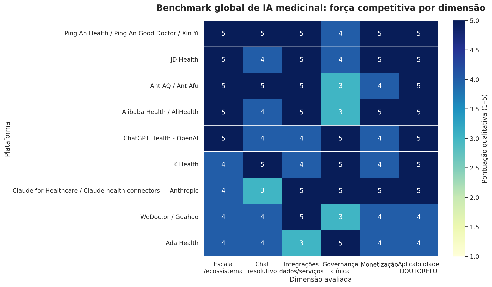

# Benchmark global dos melhores chats e plataformas de IA medicinal para orientar o DOUTORELO

## Sumário executivo

A resposta direta é: **sim, era necessário pausar a implementação e fazer este benchmark antes de continuar a Fase 3**. A pesquisa mostra que os líderes globais de IA medicinal não estão vencendo por terem apenas um chatbot “inteligente”. Eles estão vencendo porque transformam o chat em uma **porta de entrada operacional para uma jornada de saúde inteira**, capaz de coletar contexto, interpretar dados, classificar risco, preparar consulta, encaminhar para médico humano, conectar exames, farmácia, pagamentos, seguros, prontuários, acompanhamento longitudinal e conteúdo educativo.

A China aparece como o laboratório mais agressivo dessa evolução. Ant Group, Ping An Health, JD Health, WeDoctor e Alibaba Health mostram que o padrão competitivo chinês é menos “chatbot médico” e mais **superapp de cuidado**, onde IA, médicos, hospitais, farmácia, logística, pagamentos, seguro e dados pessoais são integrados dentro de uma mesma jornada. O lançamento do AQ/Ant Afu pela Ant Group é especialmente relevante porque a própria Ant o apresentou como um app de saúde **AI-native** com mais de 100 milhões de usuários totais em 2026, com recursos de perguntas e respostas de saúde, análise de pele por IA, consulta por voz, metas personalizadas e registros digitais de saúde.[1]

No Ocidente, ChatGPT Health, Claude for Healthcare, Ada Health e K Health apontam outro padrão igualmente importante: **segurança, governança, avaliação clínica, privacidade separada, integração com dados pessoais e humano no circuito**. OpenAI afirma que mais de 230 milhões de pessoas fazem perguntas de saúde e bem-estar ao ChatGPT semanalmente, e posiciona o ChatGPT Health como um espaço separado com dados de saúde conectados, memórias separadas, criptografia adicional e avaliação clínica por rubricas.[2] Anthropic, por sua vez, posiciona Claude em saúde como infraestrutura de workflows clínicos, administrativos, FHIR, PubMed, ICD-10, autorização prévia e conectores de dados pessoais.[3]

> **Tese central:** o DOUTORELO não deve ser construído como “mais um chat médico”. Ele deve nascer como um **copiloto de saúde integrativa governado**, com chat como interface principal, mas sustentado por intake clínico estruturado, RAG auditável, limites de segurança, memória longitudinal, encaminhamento humano, preparação de consulta, trilhas de acompanhamento, métricas de qualidade e uma arquitetura pronta para integrar serviços.

## Metodologia e recorte

O benchmark foi conduzido em duas camadas. A primeira camada analisou profundamente nove plataformas centrais: **Ant AQ/Ant Afu**, **Ping An Health/Ping An Good Doctor/Xin Yi**, **JD Health**, **WeDoctor/Guahao**, **Alibaba Health/AliHealth**, **ChatGPT Health**, **Claude for Healthcare**, **Ada Health** e **K Health**. A segunda camada considerou referências complementares de governança, avaliação e saúde digital, incluindo Stanford HAI, OMS, NIST e literatura sobre confiança em saúde digital.

A pontuação abaixo é **qualitativa**, baseada em fontes públicas, páginas oficiais, relatórios setoriais e fichas de pesquisa estruturadas. Ela não mede qualidade clínica absoluta nem substitui auditoria médica. O objetivo é medir força competitiva observável, sofisticação de ecossistema e relevância estratégica para o DOUTORELO.

| Ranking estratégico | Plataforma | Região-base | Força principal | Leitura para o DOUTORELO |
|---:|---|---|---|---|
| 1 | Ping An Health / Ping An Good Doctor / Xin Yi | China | Ecossistema integrado com médicos, hospitais, farmácias, seguros, senior care e IA médica 24/7 | Referência máxima de **chat como front door de ecossistema** |
| 2 | JD Health | China | LLM médico, AI Diagnosis Assistant, Doctor Digital Twin, Personal Medical Butler e integração hospitalar | Referência de **copiloto operacional de jornada clínica** |
| 3 | Ant AQ / Ant Afu | China | App AI-native de saúde com escala massiva, voz, análise visual, metas e registros digitais | Referência de **adoção massiva, experiência simples e companhia de saúde** |
| 4 | ChatGPT Health | EUA/global | Padrão de consumidor para saúde conectada, privacidade separada e avaliação clínica | Referência de **expectativa de UX e confiança para o usuário final** |
| 5 | K Health | EUA | IA + médicos licenciados + atenção primária virtual + parcerias hospitalares | Referência de **modelo híbrido IA-humano resolutivo** |
| 6 | Claude for Healthcare | EUA/global | Workflows enterprise, conectores, FHIR, PubMed, autorização prévia e dados pessoais | Referência de **infraestrutura clínica e interoperabilidade** |
| 7 | Alibaba Health / AliHealth | China | Farmácia, cloud hospital, e-commerce, Medical AI, Medical Big Model e distribuição Alibaba | Referência de **monetização e logística em saúde** |
| 8 | Ada Health | Europa/global | Symptom assessment clinicamente estruturado e governança de segurança | Referência de **triagem clara, segura e mensurável** |
| 9 | WeDoctor / Guahao | China | Infraestrutura de consulta, prescrição, diagnóstico, hospitais, farmácias e seguros | Referência de **rede de acesso e integração institucional** |

## Matriz comparativa das plataformas

A matriz gerada durante a análise atribuiu notas de 1 a 5 para seis dimensões: escala/ecossistema, resolutividade do chat, integração de dados e serviços, governança clínica, monetização e aplicabilidade ao DOUTORELO. O resultado indica que **Ping An, JD Health, Ant, ChatGPT Health, K Health e Claude** são as referências mais estratégicas para decisões de produto e arquitetura.

| Plataforma | Escala/ecossistema | Chat resolutivo | Integrações de dados/serviços | Governança clínica | Monetização | Aplicabilidade ao DOUTORELO | Total |
|---|---:|---:|---:|---:|---:|---:|---:|
| Ping An Health / Ping An Good Doctor / Xin Yi | 5 | 5 | 5 | 4 | 5 | 5 | 29 |
| JD Health | 5 | 4 | 5 | 4 | 5 | 5 | 28 |
| Ant AQ / Ant Afu | 5 | 5 | 5 | 3 | 4 | 5 | 27 |
| Alibaba Health / AliHealth | 5 | 4 | 5 | 3 | 5 | 5 | 27 |
| ChatGPT Health | 5 | 4 | 4 | 5 | 4 | 5 | 27 |
| K Health | 4 | 5 | 4 | 5 | 4 | 5 | 27 |
| Claude for Healthcare | 4 | 3 | 5 | 5 | 5 | 5 | 27 |
| WeDoctor / Guahao | 4 | 4 | 5 | 3 | 4 | 4 | 24 |
| Ada Health | 4 | 4 | 3 | 5 | 4 | 4 | 24 |

## O que os melhores chats de IA medicinal realmente fazem

A maior descoberta do benchmark é que os melhores produtos não tentam “resolver tudo” por texto livre. Eles constroem uma arquitetura em que o chat é apenas a superfície visível de um sistema mais profundo. O usuário sente que está conversando com uma IA, mas por trás existe um mecanismo de coleta estruturada de dados, avaliação de risco, regras de segurança, memória, integração com serviços e encaminhamento humano.

| Padrão observado | Como aparece nos líderes | Implicação para o DOUTORELO |
|---|---|---|
| Chat como porta de entrada | Ant, Ping An, JD Health e K Health usam a IA para iniciar a jornada e não apenas responder perguntas | O chat deve ser a **home operacional** do cuidado, não uma função lateral |
| Intake clínico estruturado | K Health e JD Health coletam história e contexto antes da decisão | O DOUTORELO precisa de questionários dinâmicos guiados por risco, não apenas conversa livre |
| Encaminhamento humano | K Health, Ping An e JD conectam IA com médicos e serviços | A IA deve preparar consulta, resumir caso e acionar médico quando necessário |
| Dados pessoais conectados | ChatGPT Health e Claude conectam records, labs, Apple Health, Android Health Connect e outros dados | O DOUTORELO deve preparar uma arquitetura de **memória longitudinal isolada** e consentida |
| Governança visível | Ada, ChatGPT Health, Claude e K Health enfatizam segurança, limites e validação | A interface deve mostrar limites, incerteza, red flags, fonte e razão do encaminhamento |
| Ecossistema transacional | China integra consulta, farmácia, pagamento, seguro, logística e hospital | O DOUTORELO deve ser modular para integrar agenda, pagamento, exames e marketplace no futuro |
| Pós-cuidado | JD, Ping An e K Health incluem medicação, follow-up, lembretes e educação | A jornada deve continuar depois do chat inicial com plano, metas e acompanhamento |

## China: o padrão mais avançado de ecossistema

### Ant AQ / Ant Afu

O AQ/Ant Afu é a referência mais importante para entender o novo consumidor de saúde AI-native. A Ant Group informou que o app ultrapassou 100 milhões de usuários totais durante o Ano Novo Chinês de 2026, com uso forte em cidades menores e recursos como perguntas e respostas de saúde, análise de pele por IA, consultas por chamada de voz, metas personalizadas e registros digitais de saúde.[1] Uma reportagem da Rest of World havia descrito o Ant Afu como chatbot de saúde dentro do ecossistema Alipay, com cerca de 30 milhões de usuários ativos mensais, análise de exames, lembretes de exercício/medicação, consultas online/offline, pagamentos e seguros.[4]

A lição para o DOUTORELO é que a experiência precisa parecer **simples, familiar e resolutiva**, mas sem sacrificar segurança. A Ant vence porque combina linguagem acessível, escala de distribuição, integração transacional e utilidade diária. Para o DOUTORELO, isso significa que a IA não deve falar apenas quando o usuário tem sintomas. Ela deve ajudar em metas, acompanhamento, revisão de exames, preparação de consulta, hábitos e continuidade.

### Ping An Health / Ping An Good Doctor / Xin Yi

Ping An é a melhor referência de integração sistêmica. A página institucional da Ping An descreve um ecossistema que combina finanças, saúde, senior care, seguradora, médicos, hospitais, farmácias e cuidado domiciliar. Em 2024, a Ping An Health tinha mais de 31 milhões de usuários pagantes em negócios estratégicos, o Ping An Family Doctor serviu mais de 14 milhões de membros, e a rede doméstica incluía 50 mil médicos próprios ou contratados, parcerias com mais de 36 mil hospitais, 104 mil instituições de gestão de saúde e 235 mil farmácias.[5]

O recurso Xin Yi adiciona uma camada de IA generativa com avatares digitais de médicos reais, interação por texto, voz e vídeo, consulta assistida 24/7, interpretação simplificada de relatórios e lembretes personalizados de medicação. A reportagem da Healthcare IT News descreve uma arquitetura com três camadas de treinamento: modelo médico base, base de conhecimento do médico-avatar e fine-tuning/anotação pelo próprio médico.[6]

A lição para o DOUTORELO é dupla. Primeiro, o melhor produto não é o que responde mais bonito, mas o que **orquestra cuidado**. Segundo, o uso de conteúdo de especialistas pode ser poderoso, mas precisa ser feito de forma auditável, versionada e governada. No DOUTORELO, a direção correta não é criar um avatar que se passe por médico específico, e sim usar conteúdo validado como base de conhecimento com citações, versionamento, revisão e limites explícitos.

### JD Health

JD Health é especialmente relevante porque descreve explicitamente uma suíte LLM para cenários online e hospitalares. A página oficial da JD afirma que a suíte **AI Jingyi** inclui AI Diagnosis Assistant 2.0, AI Research Assistant e AI Doctor Digital Twin, enquanto o **JOY DOC/JDY Doc** inclui Personal Medical Butler, Doctor Digital Twin e Future Digital Hospital. A JD afirma que o AI Diagnosis Assistant 2.0 alcançou 99,5% de acurácia de triagem, melhorou a eficiência da escrita de prontuário eletrônico em 120% e resolveu mais de 90% dos problemas na primeira tentativa.[7]

O ponto mais importante é o **Personal Medical Butler**: ele pré-avalia condições, ajuda o paciente a escolher consulta online ou offline, sugere departamentos e médicos, otimiza filas, cobrança, exames e medicação. Isso mostra que o chat médico líder não é apenas um gerador de respostas; é um **coordenador de percurso**.

Para o DOUTORELO, JD Health sugere que a arquitetura deve suportar intake pré-consulta, sumário para médico, alertas de alto risco, plano de acompanhamento, lembretes e roteamento para serviços. Esse é um ajuste importante: a Fase 3 não deve se limitar a melhorar o LLM; ela deve criar as bases do **motor de jornada**.

### Alibaba Health / AliHealth

A AliHealth se descreve como a plataforma flagship do Alibaba Group para recursos médicos e de saúde online/offline, com solução one-stop. Sua estratégia de “três nuvens” combina cloud-based infrastructure, cloud-based pharmacy e cloud-based hospital, com menções explícitas a cloud computing, Medical AI, medical knowledge graphs, Medical Big Model, traceability code e digital healthcare.[8]

A força da AliHealth não está apenas no chat. Está na monetização e infraestrutura: farmácia, e-commerce, logística, rastreabilidade, cloud hospital e distribuição via ecossistema Alibaba. Para o DOUTORELO, a lição é que marketplace e conteúdo não devem parecer módulos comerciais separados; eles devem ser conectados a uma jornada de cuidado com **separação ética entre orientação educativa, recomendação comercial e decisão clínica**.

### WeDoctor / Guahao

A WeDoctor é uma referência de infraestrutura institucional. A Investcorp descreve a empresa como fundada por Jerry Liao, especialista em IA, com mais de 240 milhões de usuários registrados para consulta online, prescrição e serviços de diagnóstico, conectando hospitais, médicos, pacientes, farmácias, seguradoras e serviços financeiros.[9]

A lição para o DOUTORELO é que escala em saúde digital depende de rede. O produto não precisa nascer com a rede completa, mas precisa nascer com arquitetura preparada para ela. O chat deve capturar intenção, organizar dados, classificar risco e encaminhar para o próximo recurso adequado, ainda que no início esse recurso seja uma lista curada, uma solicitação de consulta ou um fallback humano.

## Ocidente: governança, privacidade e validação clínica

### ChatGPT Health

ChatGPT Health redefine a expectativa do usuário comum. A OpenAI afirma que o produto conecta dados de saúde e bem-estar, como Apple Health, Function e MyFitnessPal, opera em espaço separado, com memórias separadas, criptografia e isolamento adicionais, e não usa conversas de saúde para treinar modelos de fundação.[2] A OpenAI também declara que o produto apoia, mas não substitui, cuidado médico, e que seu desenvolvimento envolveu mais de 260 médicos em 60 países, mais de 600 mil feedbacks em 30 áreas e avaliação por HealthBench.[2]

A implicação é direta: usuários compararão qualquer chat de saúde com a fluidez, personalização e confiança percebida de grandes LLMs. O DOUTORELO não precisa superar ChatGPT em generalidade; precisa superá-lo em **verticalidade, governança, contexto integrativo, jornada e conexão humana**.

### Claude for Healthcare

Claude é menos um app médico de consumidor e mais uma infraestrutura de workflows. A Anthropic destaca conectores para CMS Coverage Database, ICD-10, National Provider Identifier Registry e PubMed, além de Agent Skills para FHIR e revisão de autorização prévia. Os usos incluem coordenação de cuidado, triagem de mensagens, ambient scribing, revisão de prontuários e apoio a decisões clínicas. No consumidor, Claude conecta labs, health records, Apple Health e Android Health Connect para resumir histórico, explicar exames, detectar padrões e preparar perguntas para consulta.[3]

A lição para o DOUTORELO é que a camada de IA precisa ser desenhada em dois planos: **plano do paciente**, com linguagem simples e acolhedora; e **plano clínico-operacional**, com dados estruturados, logs, rastreabilidade, sumários, riscos e futuras integrações.

### Ada Health

Ada Health permanece referência importante por causa da disciplina de triagem. Seu posicionamento oficial enfatiza avaliação de sintomas baseada em uma biblioteca médica criada por médicos e conteúdo educativo para apoiar decisões de saúde.[10] Em notas anteriores do benchmark, a Ada também foi tratada como referência em avaliação por cobertura, acurácia e segurança, não apenas em UX.

A lição para o DOUTORELO é que **segurança precisa virar métrica visível**. A plataforma deveria medir e exibir taxa de fallback, taxa de red flags detectadas, taxa de recusa de diagnóstico/prescrição, cobertura de casos avaliados, revisão clínica e incerteza explícita.

### K Health

K Health é referência no modelo híbrido IA + médico. A página oficial posiciona a empresa como acesso 24/7 a cuidado de qualidade, conectando IA, atendimento virtual e presencial com grandes sistemas de saúde.[11] A análise estruturada também identificou parcerias com sistemas como Cedars-Sinai, Mayo Clinic, Hackensack Meridian Health, Hartford HealthCare, Mass General Brigham e Northwell Health, além de uso de modelo Gemma em sua evolução de AI physician.[12]

A lição central é que o chat deve **preparar o trabalho humano**, não fingir substituí-lo. A IA coleta dados, organiza contexto, sugere caminhos e melhora eficiência; o diagnóstico e tratamento final ficam com profissional licenciado quando há risco clínico real.

## O que isso muda na direção do DOUTORELO

A direção anterior do DOUTORELO estava correta em vários fundamentos: RAG auditável, feedback loop, avaliação diária, versionamento de prompts, detecção de red flags, bloqueio de prescrição e humano no circuito. O benchmark, porém, mostra que essa fundação deve ser reposicionada. Ela não deve existir apenas para “fazer o chat responder melhor”; deve existir para suportar uma **jornada longitudinal de cuidado integrativo**.

| Decisão estratégica | Antes do benchmark | Depois do benchmark |
|---|---|---|
| Papel do chat | Assistente de triagem e orientação | **Copiloto de jornada**, intake, risco, encaminhamento, plano e follow-up |
| RAG | Base de conhecimento para respostas | **Camada auditável de evidência**, com fontes, versão, limites e revisão clínica |
| IA clínica | Resposta estruturada segura | **Motor governado de decisão assistiva**, com métricas e avaliação contínua |
| UX | Chat premium com módulos laterais | **Cockpit de cuidado**, onde chat, plano, médico, conteúdo e marketplace conversam entre si |
| Dados do usuário | Estado de sessão e perfil básico | **Memória longitudinal consentida**, isolada, revisável e apagável |
| Marketplace | Catálogo separado com copy não prescritiva | **Recurso comercial contextual**, separado de prescrição e acionado por regras éticas |
| Médico humano | Fallback de segurança | **Parte central da proposta de valor**, com sumário, triagem e preparação |
| Métricas | Testes e logs técnicos | **Métricas públicas de confiança**, segurança, red flags, fallback e satisfação |

## Arquitetura recomendada para a próxima fase

A próxima fase técnica deve ser redesenhada ao redor de sete camadas. A primeira é o **orquestrador conversacional**, responsável por transformar texto, voz ou entrada guiada em uma intenção de cuidado. A segunda é o **intake clínico estruturado**, com perguntas dinâmicas, red flags, tempo de evolução, intensidade, histórico, medicamentos, restrições, objetivos e contexto integrativo. A terceira é a **camada RAG auditável**, com fontes versionadas, trechos recuperados, escore de confiança, data de revisão e política anti-alucinação.

A quarta camada é o **motor de segurança clínica**, com regras determinísticas para urgência, bloqueio de diagnóstico/prescrição, incerteza obrigatória, fallback humano e logs de risco. A quinta é a **memória longitudinal consentida**, separando dados de saúde, preferências, metas, exames e histórico de interações. A sexta é o **handoff humano**, que transforma a conversa em sumário útil para médico, com motivo da consulta, hipóteses não diagnósticas, sinais de alerta, perguntas pendentes e próximos passos seguros. A sétima é a **camada de avaliação e melhoria**, com dataset de casos, testes diários, avaliação por rubricas clínicas, revisão humana e versionamento.

| Camada | Função | Prioridade | Por quê |
|---|---|---:|---|
| Orquestrador conversacional | Entender intenção e dirigir a jornada | Alta | Sem isso, o chat vira Q&A genérico |
| Intake clínico estruturado | Coletar dados de forma segura | Alta | K Health, JD e Ada dependem disso para resolutividade |
| RAG auditável | Responder com fonte, limite e versão | Alta | Evita alucinação e transforma conteúdo especialista em ativo confiável |
| Motor de segurança | Red flags, incerteza e fallback | Alta | Saúde exige “responder com segurança ou não responder” |
| Memória longitudinal | Contexto pessoal e acompanhamento | Média-alta | ChatGPT Health e Claude elevam expectativa de dados conectados |
| Handoff humano | Preparar consulta e reduzir fricção | Alta | Líderes usam IA para aumentar capacidade humana |
| Avaliação contínua | Medir cobertura, segurança e qualidade | Alta | Sem métrica, a confiança é apenas promessa |

## Como o chat do DOUTORELO deveria “resolver tudo” sem virar risco clínico

O benchmark sugere que “resolver tudo pelo chat” não significa dar diagnóstico, prescrição ou conduta médica autônoma. Significa que o usuário não precisa ficar procurando onde clicar, nem repetindo a própria história, nem tentando entender sozinho o próximo passo. O chat deve resolver a **navegação, a organização e a continuidade**, mantendo decisão clínica de risco sob controle humano.

| Situação do usuário | O que o chat deve resolver | O que não deve fazer |
|---|---|---|
| Sintoma novo | Coletar contexto, detectar red flags, orientar nível de atenção e preparar consulta | Dar diagnóstico definitivo ou prescrever tratamento |
| Exame recebido | Explicar termos, destacar pontos para discutir com médico e registrar no histórico | Interpretar como laudo clínico final ou substituir médico |
| Meta de saúde | Criar trilha educativa, lembretes, hábitos e acompanhamento | Prometer cura, emagrecimento ou reversão sem avaliação |
| Produto/suplemento | Separar educação, contraindicações gerais e encaminhar para profissional quando necessário | Recomendar compra como prescrição médica |
| Consulta marcada | Gerar resumo, perguntas para levar e checklist pré-consulta | Substituir anamnese médica formal |
| Pós-consulta | Organizar plano, lembretes, dúvidas e sinais de alerta | Alterar conduta médica ou medicação |

## Recomendações práticas antes de voltar ao código

A implementação da Fase 3 deve ser retomada com um ajuste de escopo. Em vez de começar apenas pelo RAG ou pelo modelo, a próxima entrega deveria construir o **núcleo de jornada governada**. Esse núcleo deve incluir o contrato de conversa, a estrutura de dados do intake, a política de red flags, o schema de memória longitudinal, o formato de sumário para médico, o registry de fontes RAG e a suíte de avaliação.

| Prioridade | Recomendação | Resultado esperado |
|---:|---|---|
| 1 | Definir taxonomia de jornadas: sintomas, exame, meta, conteúdo, produto, consulta, pós-consulta | O chat deixa de ser genérico e passa a operar fluxos claros |
| 2 | Criar schema de intake clínico por jornada | O backend passa a armazenar contexto útil e seguro |
| 3 | Implementar RAG com fonte, trecho, versão, confiança e limite | Respostas tornam-se auditáveis e menos sujeitas a alucinação |
| 4 | Criar motor de red flags e incerteza obrigatória | A IA escala quando deve e não inventa quando não sabe |
| 5 | Implementar sumário de caso para médico/humano | A IA aumenta capacidade da rede humana |
| 6 | Implementar dataset de avaliação e testes diários | Qualidade deixa de depender de percepção subjetiva |
| 7 | Tornar governança visível na UI | Confiança vira parte do produto, não apenas do backend |
| 8 | Preparar arquitetura modular para agenda, exames, marketplace e pagamento | O DOUTORELO fica pronto para virar ecossistema sem gambiarra |

## Riscos estratégicos identificados

O primeiro risco é construir um chat bonito, mas sem resolutividade operacional. Esse seria o erro mais grave, porque o benchmark mostra que o usuário de 2026 espera continuidade, contexto e encaminhamento. O segundo risco é exagerar a autonomia clínica. O produto deve ser ambicioso em navegação e acompanhamento, mas conservador em diagnóstico, prescrição e decisão de risco. O terceiro risco é deixar a governança invisível. Em saúde, confiança precisa ser demonstrada com métricas, fontes, limites, revisão e linguagem clara.

| Risco | Consequência | Mitigação recomendada |
|---|---|---|
| Chat genérico | O produto parece inferior a ChatGPT Health | Verticalizar por jornadas, dados, médico e acompanhamento |
| Autonomia clínica excessiva | Risco regulatório, reputacional e de segurança | Motor de limites, red flags e fallback humano |
| Marketplace mal acoplado | Percepção de conflito de interesse | Separação entre educação, comércio e conduta clínica |
| Falta de dados longitudinal | Baixa retenção e baixa personalização | Memória consentida, revisável e apagável |
| Ausência de métricas | Confiança vira discurso | Dashboard de segurança, qualidade, fallback e revisão |
| Dependência de conteúdo não governado | Risco de inconsistência ou alucinação | RAG versionado, fontes auditáveis e revisão clínica |

## Conclusão executiva

O benchmark confirma que o DOUTORELO está mirando um mercado correto e uma oportunidade real, mas também mostra que a ambição precisa subir. O produto não deve ser apenas um chat medicinal com visual premium. Ele deve se tornar uma **infraestrutura de cuidado integrativo assistido por IA**, onde o chat é a interface natural, mas a inteligência real está na orquestração de jornadas, segurança clínica, dados longitudinais, rede humana e capacidade de aprender com métricas.

A decisão recomendada é **não retomar a Fase 3 exatamente como estava**. Devemos retomar a Fase 3 com escopo ajustado: construir primeiro o núcleo de copiloto governado, e só depois expandir a profundidade do RAG, ML, marketplace e automações. Esse ajuste aumenta a chance de o DOUTORELO nascer alinhado ao padrão mundial, especialmente ao padrão chinês de ecossistema e ao padrão ocidental de governança.

> **Decisão recomendada:** transformar a Fase 3 em uma fase de **AI Care Journey Core**, composta por intake estruturado, RAG auditável, red flags, memória longitudinal, sumário médico, avaliação contínua e UI de confiança. Essa é a direção mais consistente com os melhores chats e plataformas de IA medicinal do mundo.

## Referências

[1]: https://www.antgroup.com/en/news-media/press-releases/1771812000000 "Ant Group — AQ, an AI-powered Healthcare App, Surpasses 100 Million Users During Chinese New Year"

[2]: https://openai.com/index/introducing-chatgpt-health/ "OpenAI — Introducing ChatGPT Health"

[3]: https://www.anthropic.com/news/healthcare-life-sciences "Anthropic — Claude for Healthcare and Life Sciences"

[4]: https://restofworld.org/2026/ai-health-care-is-taking-off-in-china-led-by-jack-mas-ant-group/ "Rest of World — AI health care is taking off in China, led by Jack Ma’s Ant Group"

[5]: https://group.pingan.com/about_us/our_businesses/health-and-senior-care.html "Ping An Group — Health and Senior Care"

[6]: https://www.healthcareitnews.com/news/asia/ping-launches-ai-avatars-top-chinese-doctors "Healthcare IT News Asia — Ping An launches AI avatars of top Chinese doctors"

[7]: https://jdcorporateblog.com/jd-health-introduces-groundbreaking-llm-powered-suite-for-comprehensive-online-and-in-hospital-healthcare-scenarios/ "JD Corporate Blog — JD Health Introduces Groundbreaking LLM-Powered Suite"

[8]: https://www.alihealth.cn/en-us/aboutus "Alibaba Health — About Us"

[9]: https://www.investcorp.com/portfolio/wedoctor/ "Investcorp — WeDoctor"

[10]: https://ada.com/ "Ada Health — Official website"

[11]: https://khealth.com/ "K Health — Official website"

[12]: https://deepmind.google/models/gemma/gemmaverse/k-health/ "Google DeepMind — K Health enhances its AI physician"

[13]: https://www.globenewswire.com/news-release/2025/07/18/3117756/28124/en/ping-an-good-doctor-wedoctor-guahao-jd-health-international-and-alihealth-alibaba-health-lead-china-s-telemedicine-market-in-2025-industry-to-reach-usd-18-93-billion-by-2034.html "GlobeNewswire / Research and Markets — China telemedicine market leaders"

[14]: https://hai.stanford.edu/news/stanford-develops-real-world-benchmarks-healthcare-ai-agents "Stanford HAI — Real-World Benchmarks for Healthcare AI Agents"

[15]: https://www.who.int/news/item/18-01-2024-who-releases-ai-ethics-and-governance-guidance-for-large-multi-modal-models "World Health Organization — AI ethics and governance guidance for large multi-modal models"

[16]: https://www.nist.gov/itl/ai-risk-management-framework "NIST — AI Risk Management Framework"
